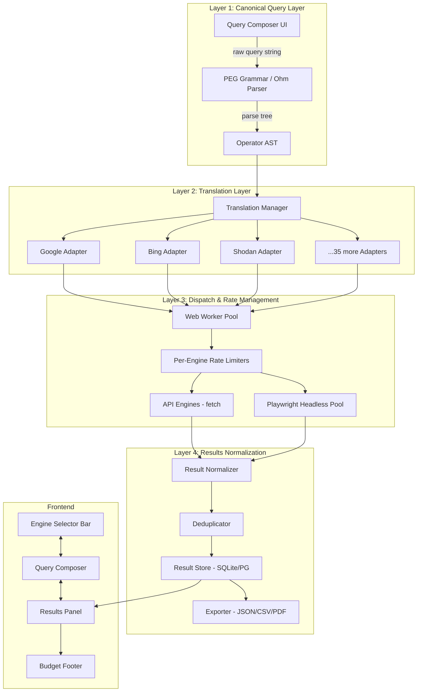
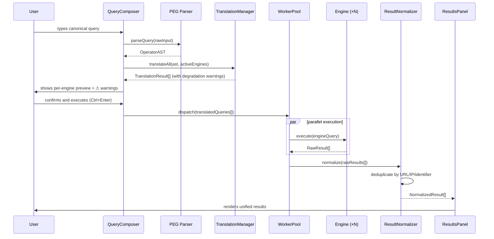
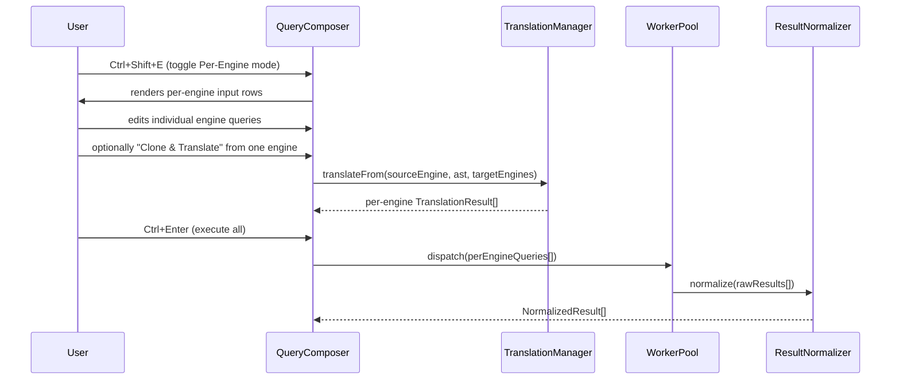

# Design Document: DORKSTAR

## Overview

DORKSTAR is a universal query translation engine built as a SvelteKit application that converts a single canonical search syntax into 39 engine-native search formats and executes queries in parallel across multiple search platforms. It is not a search aggregator — it is a query permutation engine. Users write one query in a canonical operator language; DORKSTAR parses it into an operator AST via a PEG grammar, translates that AST into each engine's native syntax, dispatches requests in parallel through a worker pool with per-engine rate limiting, and normalizes results into a unified, deduplicated view.

The system targets security researchers, OSINT practitioners, investigative journalists, and bug bounty hunters who currently waste hours manually reformulating queries per engine. DORKSTAR eliminates that friction by providing a single authoritative query surface, graceful degradation warnings when operators have no engine equivalent, and three result view modes (Unified, By Engine, Deduplicated). All API keys are stored exclusively in browser IndexedDB — no server-side key storage exists.

The architecture is organized into four layers: (1) Canonical Query Layer — PEG grammar parser producing an operator AST; (2) Translation Layer — 39 engine adapter modules that convert the AST to native syntax; (3) Dispatch & Rate Management — a Web Worker pool with per-engine rate limiters and a Playwright headless pool for no-API engines; (4) Results Normalization — deduplication, scoring, merging, and export. The frontend is a three-zone SvelteKit layout: Engine Selector Bar, Query Composer, and Results Panel.

## Architecture

### Four-Layer System Architecture



### Engine Categories and Tiers

| Tier | Description | Engines (examples) | Dispatch Method |
|------|-------------|-------------------|-----------------|
| 1 | Full API with key | Shodan, Censys, VirusTotal, GitHub, Pastebin | `fetch` via Worker |
| 2 | Limited free API | Google CSE (100/day), Bing Search API | `fetch` via Worker |
| 3 | No public API | Qwant, Ecosia, Seznam, Sogou, Daum, CocCoc, Mail.ru, 360 Search | Playwright headless |

### Data Flow: Unified Query Execution



### Data Flow: Per-Engine Permutation Mode



## Components and Interfaces

### Component 1: PEG Grammar Parser (`src/lib/parser/`)

**Purpose**: Parse raw canonical query strings into a typed Operator AST using an Ohm/PEG.js grammar.

**Interface**:
```typescript
// src/lib/parser/types.ts

export type NodeKind =
  | 'BooleanExpr' | 'OperatorExpr' | 'ExcludeTerm' | 'IncludeTerm'
  | 'ExactPhrase' | 'ProximityExpr' | 'RangeExpr' | 'WildcardPhrase' | 'BareWord';

export interface ASTNode {
  kind: NodeKind;
}

export interface BooleanExpr extends ASTNode {
  kind: 'BooleanExpr';
  op: 'AND' | 'OR' | 'NOT';
  left: ASTNode;
  right: ASTNode;
}

export interface OperatorExpr extends ASTNode {
  kind: 'OperatorExpr';
  operator: CanonicalOperator;  // e.g. 'site', 'filetype', 'intitle', 'ip', 'port', ...
  value: string | RangeValue | WildcardValue;
}

export interface ExactPhrase extends ASTNode {
  kind: 'ExactPhrase';
  phrase: string;
}

export interface RangeExpr extends ASTNode {
  kind: 'RangeExpr';
  operator: CanonicalOperator;
  min: number | string;
  max: number | string;
}

export interface BareWord extends ASTNode {
  kind: 'BareWord';
  value: string;
}

export type CanonicalOperator =
  | 'site' | 'filetype' | 'ext' | 'intitle' | 'allintitle' | 'inurl' | 'allinurl'
  | 'intext' | 'allintext' | 'inbody' | 'inanchor' | 'allinanchor' | 'inpage'
  | 'ip' | 'port' | 'hostname' | 'org' | 'asn' | 'net' | 'country' | 'city'
  | 'os' | 'product' | 'version' | 'vuln' | 'ssl.jarm' | 'ssl.ja3s'
  | 'http.favicon.hash' | 'has_screenshot' | 'mime' | 'url' | 'rhost' | 'host'
  | 'domain' | 'lang' | 'language' | 'loc' | 'location' | 'related' | 'cache'
  | 'define' | 'source' | 'feed' | 'hasfeed' | 'contains' | 'prefer' | 'repo'
  | 'user' | 'path' | 'content' | 'symbol' | 'author' | 'subreddit' | 'flair'
  | 'self' | 'selftext' | 'title' | 'from' | 'to' | 'filter' | 'since' | 'until'
  | 'min_retweets' | 'min_faves' | 'min_replies' | 'before' | 'after' | 'daterange'
  | 'date' | 'classification' | 'actor' | 'tags' | 'cve' | 'labels'
  | 'services.port' | 'services.http.response.html_title' | 'app' | 'ver' | 'device'
  | 'cidr' | 'banner' | 'service' | 'protocol' | 'jarm' | 'http.title' | 'http.body'
  | 'is_vulnerability' | 'tag' | 'tech' | 'fieldsOfStudy' | 'venue'
  | 'minCitationCount' | 'matchType' | 'output' | 'fl' | 'limit' | 'collapse';

// src/lib/parser/index.ts
export interface ParseResult {
  ast: ASTNode;
  errors: ParseError[];
}

export interface ParseError {
  message: string;
  position: number;
  length: number;
}

export function parseQuery(input: string): ParseResult;
export function validateQuery(input: string): ParseError[];
```

**Responsibilities**:
- Define and compile the Ohm grammar for the canonical query language
- Produce a typed AST from raw query strings
- Report parse errors with position information for inline editor highlighting
- Support all canonical operators defined in the grammar spec

---

### Component 2: Translation Manager (`src/lib/translation/`)

**Purpose**: Convert an Operator AST into engine-native query strings for all active engines, reporting degradation when operators have no equivalent.

**Interface**:
```typescript
// src/lib/translation/types.ts

export interface TranslationResult {
  engineId: EngineId;
  nativeQuery: string;
  degradations: DegradationWarning[];
  isFullySupported: boolean;
}

export interface DegradationWarning {
  operator: CanonicalOperator;
  reason: 'unsupported' | 'partial' | 'approximated';
  message: string;
}

export type EngineId =
  | 'google' | 'bing' | 'yandex' | 'duckduckgo' | 'baidu' | 'yahoo'
  | 'shodan' | 'censys' | 'fofa' | 'zoomeye' | 'binaryedge' | 'onyphe'
  | 'leakix' | 'netlas' | 'criminalip' | 'hunter' | 'fullhunt'
  | 'github' | 'gitlab' | 'sourcegraph' | 'grep_app'
  | 'virustotal' | 'urlscan' | 'alienvault' | 'threatcrowd'
  | 'pastebin' | 'gist' | 'publicwww' | 'grep_io'
  | 'twitter' | 'reddit' | 'linkedin'
  | 'arxiv' | 'semantic_scholar' | 'pubmed'
  | 'qwant' | 'ecosia' | 'seznam' | 'sogou';

// src/lib/translation/manager.ts
export interface TranslationManager {
  translateAll(ast: ASTNode, engines: EngineId[]): TranslationResult[];
  translateOne(ast: ASTNode, engineId: EngineId): TranslationResult;
  translateFrom(sourceEngine: EngineId, ast: ASTNode, targetEngines: EngineId[]): TranslationResult[];
  getSupportedOperators(engineId: EngineId): CanonicalOperator[];
  getCommonOperators(engines: EngineId[]): CanonicalOperator[];
}
```

**Responsibilities**:
- Maintain a registry of 39 engine adapters
- Walk the AST and call each adapter's `translate()` method
- Collect and surface degradation warnings per engine
- Provide operator intersection for autocomplete filtering

---

### Component 3: Engine Adapter (`src/lib/translation/adapters/`)

**Purpose**: Each adapter encapsulates the translation logic and operator support map for one search engine.

**Interface**:
```typescript
// src/lib/translation/adapters/base.ts

export interface EngineAdapter {
  readonly engineId: EngineId;
  readonly displayName: string;
  readonly category: EngineCategory;
  readonly tier: 1 | 2 | 3;
  readonly supportedOperators: ReadonlySet<CanonicalOperator>;
  readonly operatorCount: number;

  translate(node: ASTNode): TranslationResult;
  translateNode(node: ASTNode): string | null;
  supportsOperator(op: CanonicalOperator): boolean;
}

export type EngineCategory =
  | 'web' | 'iot' | 'code' | 'threat' | 'paste' | 'social' | 'academic' | 'all';

// Example: src/lib/translation/adapters/google.ts
export class GoogleAdapter implements EngineAdapter {
  readonly engineId = 'google' as const;
  readonly displayName = 'Google';
  readonly category = 'web' as const;
  readonly tier = 2 as const;
  readonly supportedOperators: ReadonlySet<CanonicalOperator>;
  // translate() maps: site→site:, filetype→filetype:, intitle→intitle:,
  //   inurl→inurl:, intext→intext:, related→related:, cache→cache:,
  //   daterange→daterange:, before→before:, after→after:
  // Unsupported: ip, port, asn, vuln, ssl.*, http.*, services.*, etc.
}
```

**Responsibilities**:
- Declare which canonical operators are supported
- Implement `translateNode()` for each supported operator
- Return `DegradationWarning` for unsupported operators (never silently drop)
- Handle engine-specific quoting, escaping, and boolean syntax

---

### Component 4: Worker Pool & Dispatch (`src/lib/dispatch/`)

**Purpose**: Execute translated queries against engines in parallel using Web Workers, with per-engine rate limiting and credit tracking.

**Interface**:
```typescript
// src/lib/dispatch/types.ts

export interface EngineQuery {
  engineId: EngineId;
  nativeQuery: string;
  apiKey?: string;
  options?: EngineQueryOptions;
}

export interface EngineQueryOptions {
  maxResults?: number;
  page?: number;
  timeout?: number;
}

export interface RawResult {
  engineId: EngineId;
  items: RawResultItem[];
  totalEstimated?: number;
  creditsUsed?: number;
  error?: DispatchError;
}

export interface RawResultItem {
  url?: string;
  ip?: string;
  identifier?: string;
  title?: string;
  snippet?: string;
  metadata: Record<string, unknown>;
  timestamp: string;
}

export interface DispatchError {
  code: 'rate_limited' | 'auth_failed' | 'timeout' | 'anti_bot' | 'network' | 'unknown';
  message: string;
  retryAfter?: number;
}

// src/lib/dispatch/worker-pool.ts
export interface WorkerPool {
  dispatch(queries: EngineQuery[]): Promise<RawResult[]>;
  dispatchOne(query: EngineQuery): Promise<RawResult>;
  getStatus(): WorkerPoolStatus;
  shutdown(): void;
}

export interface WorkerPoolStatus {
  activeWorkers: number;
  queuedJobs: number;
  perEngineStatus: Record<EngineId, EngineStatus>;
}

export interface EngineStatus {
  quotaUsed: number;
  quotaLimit: number;
  resetAt?: string;
  isRateLimited: boolean;
}
```

**Responsibilities**:
- Spawn Web Workers for API-tier engines (Tier 1 & 2)
- Route Tier 3 engines to the Playwright headless pool (server-side SvelteKit endpoint)
- Enforce per-engine rate limits using token bucket algorithm
- Show Shodan credit confirmation dialogs before consuming credits
- Propagate `DispatchError` without throwing — errors are first-class results

---

### Component 5: Result Normalizer (`src/lib/results/`)

**Purpose**: Merge raw results from all engines into a unified, deduplicated, scored result set.

**Interface**:
```typescript
// src/lib/results/types.ts

export interface NormalizedResult {
  id: string;                        // deterministic hash of canonical identifier
  canonicalIdentifier: string;       // URL, IP, or domain
  title: string;
  snippet: string;
  engines: EngineAttribution[];
  score: number;                     // relevance score (engine count × recency weight)
  firstSeen: string;
  metadata: Record<string, unknown>;
}

export interface EngineAttribution {
  engineId: EngineId;
  originalUrl: string;
  rank: number;
  metadata: Record<string, unknown>;
}

export type ViewMode = 'unified' | 'by-engine' | 'deduplicated';

export interface ResultSet {
  results: NormalizedResult[];
  viewMode: ViewMode;
  totalByEngine: Record<EngineId, number>;
  deduplicationStats: DeduplicationStats;
}

export interface DeduplicationStats {
  totalRaw: number;
  totalUnique: number;
  duplicatesRemoved: number;
}

// src/lib/results/normalizer.ts
export interface ResultNormalizer {
  normalize(rawResults: RawResult[]): ResultSet;
  deduplicate(results: NormalizedResult[]): NormalizedResult[];
  score(result: NormalizedResult): number;
  export(results: NormalizedResult[], format: 'json' | 'csv' | 'pdf'): Blob;
}
```

**Responsibilities**:
- Normalize heterogeneous raw result shapes into `NormalizedResult`
- Deduplicate by URL/IP/identifier using deterministic hashing
- Score results by engine attribution count and recency
- Support three view modes: Unified (interleaved), By Engine (tabbed), Deduplicated
- Export to JSON, CSV, and PDF

---

### Component 6: Key Store (`src/lib/keystore/`)

**Purpose**: Manage per-engine API keys in browser IndexedDB with zero server-side storage.

**Interface**:
```typescript
// src/lib/keystore/index.ts

export interface KeyStore {
  getKey(engineId: EngineId): Promise<string | null>;
  setKey(engineId: EngineId, key: string): Promise<void>;
  deleteKey(engineId: EngineId): Promise<void>;
  listEnginesWithKeys(): Promise<EngineId[]>;
  clearAll(): Promise<void>;
}
```

**Responsibilities**:
- Read/write API keys exclusively to browser IndexedDB
- Never transmit keys to any server endpoint
- Provide reactive key availability signals to the UI

---

### Component 7: Frontend Zones (`src/routes/`)

**Purpose**: Three-zone SvelteKit layout composing the full application UI.

**Interface**:
```typescript
// src/lib/stores/engine-store.ts
export interface EngineStore {
  activeEngines: Readable<EngineId[]>;
  toggleEngine(id: EngineId): void;
  toggleAll(): void;
  toggleCategory(category: EngineCategory): void;
  reorderEngines(from: number, to: number): void;
  persistToLocalStorage(): void;
  loadFromLocalStorage(): void;
}

// src/lib/stores/query-store.ts
export interface QueryStore {
  canonicalQuery: Writable<string>;
  mode: Writable<'unified' | 'per-engine'>;
  translations: Readable<TranslationResult[]>;
  perEngineQueries: Writable<Record<EngineId, string>>;
  ast: Readable<ASTNode | null>;
  parseErrors: Readable<ParseError[]>;
}

// src/lib/stores/results-store.ts
export interface ResultsStore {
  resultSet: Readable<ResultSet | null>;
  isLoading: Readable<boolean>;
  viewMode: Writable<ViewMode>;
  workerStatus: Readable<WorkerPoolStatus>;
}
```

**Responsibilities**:
- Engine Selector Bar: 8 category tabs + ALL toggle, engine chips with operator count badges, drag-reorder, localStorage persistence
- Query Composer: canonical input with PEG parse errors, real-time translation preview, per-engine degradation warnings, Per-Engine mode rows, operator autocomplete
- Results Panel: three view modes, engine attribution, per-result actions (Open, Re-dork, Pivot), export controls
- Budget Footer: per-engine quota usage, rate limit status

## Data Models

### Model 1: OperatorAST Node Union

```typescript
export type ASTNode =
  | BooleanExpr
  | OperatorExpr
  | ExcludeTerm
  | IncludeTerm
  | ExactPhrase
  | ProximityExpr
  | RangeExpr
  | WildcardPhrase
  | BareWord;

export interface ExcludeTerm extends ASTNode {
  kind: 'ExcludeTerm';
  term: ASTNode;
}

export interface IncludeTerm extends ASTNode {
  kind: 'IncludeTerm';
  term: ASTNode;
}

export interface ProximityExpr extends ASTNode {
  kind: 'ProximityExpr';
  left: ASTNode;
  right: ASTNode;
  distance: number;
}

export interface WildcardPhrase extends ASTNode {
  kind: 'WildcardPhrase';
  pattern: string;  // e.g. "admin*"
}

export interface RangeValue {
  min: number | string;
  max: number | string;
}

export interface WildcardValue {
  pattern: string;
}
```

**Validation Rules**:
- `BooleanExpr.op` must be one of `AND | OR | NOT`
- `OperatorExpr.operator` must be a member of `CanonicalOperator`
- `RangeExpr.min` must be ≤ `RangeExpr.max` when both are numeric
- `ProximityExpr.distance` must be a positive integer
- `WildcardPhrase.pattern` must contain at least one `*` or `?`

---

### Model 2: Engine Registry Entry

```typescript
export interface EngineRegistryEntry {
  id: EngineId;
  displayName: string;
  category: EngineCategory;
  tier: 1 | 2 | 3;
  baseUrl: string;
  apiEndpoint?: string;
  docsUrl: string;
  supportedOperators: CanonicalOperator[];
  operatorCount: number;
  requiresKey: boolean;
  creditModel?: CreditModel;
  rateLimit: RateLimitConfig;
}

export interface CreditModel {
  unit: string;           // e.g. "query", "result_page"
  costPerUnit: number;    // e.g. 1 credit per 100 result pages (Shodan)
  requiresConfirmation: boolean;
}

export interface RateLimitConfig {
  requestsPerMinute: number;
  requestsPerDay?: number;
  burstLimit?: number;
}
```

**Validation Rules**:
- `tier` must be 1, 2, or 3
- `rateLimit.requestsPerMinute` must be > 0
- `creditModel.requiresConfirmation` must be `true` for Shodan and any engine with `costPerUnit > 0`
- `operatorCount` must equal `supportedOperators.length`

---

### Model 3: Query Session

```typescript
export interface QuerySession {
  id: string;
  createdAt: string;
  canonicalQuery: string;
  ast: ASTNode;
  mode: 'unified' | 'per-engine';
  activeEngines: EngineId[];
  translations: TranslationResult[];
  resultSetId?: string;
}
```

---

### Model 4: Persisted Engine State (localStorage)

```typescript
export interface PersistedEngineState {
  activeEngines: EngineId[];
  engineOrder: EngineId[];
  lastUpdated: string;
}
```

## Algorithmic Pseudocode

### Main Query Execution Algorithm

```typescript
async function executeQuery(
  canonicalQuery: string,
  activeEngines: EngineId[],
  mode: 'unified' | 'per-engine',
  perEngineOverrides?: Record<EngineId, string>
): Promise<ResultSet> {
  // Preconditions:
  //   canonicalQuery is non-empty string
  //   activeEngines.length >= 1
  //   All engineIds in activeEngines are registered

  // Step 1: Parse
  const { ast, errors } = parseQuery(canonicalQuery);
  if (errors.length > 0 && errors.some(e => e.severity === 'error')) {
    throw new ParseError('Query contains syntax errors', errors);
  }

  // Step 2: Translate
  const translations: TranslationResult[] = mode === 'unified'
    ? translationManager.translateAll(ast, activeEngines)
    : activeEngines.map(id => ({
        engineId: id,
        nativeQuery: perEngineOverrides?.[id] ?? translationManager.translateOne(ast, id).nativeQuery,
        degradations: [],
        isFullySupported: true
      }));

  // Step 3: Confirm credits (Shodan et al.)
  const creditEngines = translations.filter(t => requiresCreditConfirmation(t.engineId));
  if (creditEngines.length > 0) {
    const confirmed = await showCreditConfirmationDialog(creditEngines);
    if (!confirmed) return emptyResultSet();
  }

  // Step 4: Dispatch in parallel
  const engineQueries: EngineQuery[] = translations.map(t => ({
    engineId: t.engineId,
    nativeQuery: t.nativeQuery,
    apiKey: await keyStore.getKey(t.engineId) ?? undefined
  }));

  const rawResults: RawResult[] = await workerPool.dispatch(engineQueries);

  // Step 5: Normalize
  const resultSet = resultNormalizer.normalize(rawResults);

  // Postconditions:
  //   resultSet.results contains only NormalizedResult with valid canonicalIdentifier
  //   resultSet.deduplicationStats.totalRaw === sum of rawResults[i].items.length
  //   resultSet.deduplicationStats.totalUnique <= totalRaw

  return resultSet;
}
```

**Preconditions**:
- `canonicalQuery` is a non-empty string
- `activeEngines` contains at least one registered engine ID
- Worker pool is initialized and not shut down

**Postconditions**:
- Returns a `ResultSet` with `results` array (may be empty on all-engine errors)
- `deduplicationStats.totalUnique` ≤ `deduplicationStats.totalRaw`
- Each `NormalizedResult` has at least one `EngineAttribution`

**Loop Invariants** (parallel dispatch):
- Each engine query is dispatched exactly once
- Rate limiter state is updated atomically per engine
- Failed engine results are captured as `DispatchError`, not thrown

---

### PEG Grammar Translation Algorithm

```typescript
function translateNode(node: ASTNode, adapter: EngineAdapter): string {
  // Preconditions:
  //   node is a valid ASTNode
  //   adapter is a registered EngineAdapter

  switch (node.kind) {
    case 'BooleanExpr': {
      const left = translateNode(node.left, adapter);
      const right = translateNode(node.right, adapter);
      // Engine-specific boolean syntax
      return adapter.formatBoolean(node.op, left, right);
      // e.g. Google: "left AND right", Shodan: "left AND right", Censys: "left and right"
    }

    case 'OperatorExpr': {
      if (!adapter.supportsOperator(node.operator)) {
        // NEVER silently drop — always record degradation
        adapter.recordDegradation(node.operator, 'unsupported');
        return '';  // omit from native query
      }
      return adapter.translateOperator(node.operator, node.value);
    }

    case 'ExactPhrase':
      return `"${node.phrase}"`;

    case 'ExcludeTerm':
      return `-${translateNode(node.term, adapter)}`;

    case 'IncludeTerm':
      return `+${translateNode(node.term, adapter)}`;

    case 'BareWord':
      return adapter.escapeBareWord(node.value);

    case 'RangeExpr': {
      if (!adapter.supportsOperator(node.operator)) {
        adapter.recordDegradation(node.operator, 'unsupported');
        return '';
      }
      return adapter.translateRange(node.operator, node.min, node.max);
    }

    case 'WildcardPhrase':
      return adapter.supportsWildcard()
        ? adapter.translateWildcard(node.pattern)
        : (adapter.recordDegradation('wildcard' as CanonicalOperator, 'unsupported'), '');

    default:
      return '';
  }

  // Postconditions:
  //   Return value is a valid string for the target engine (may be empty)
  //   All unsupported operators are recorded as degradations, never silently dropped
}
```

**Preconditions**:
- `node` is a non-null `ASTNode`
- `adapter` is initialized with its operator support map

**Postconditions**:
- Returns a string fragment valid for the target engine's syntax
- Every unsupported operator is recorded in `adapter.degradations`
- No operator is silently dropped without a `DegradationWarning`

**Loop Invariants** (recursive tree walk):
- Each node is visited exactly once
- Degradation list grows monotonically (never shrinks during a single translation)

---

### Rate Limiter (Token Bucket)

```typescript
class TokenBucketRateLimiter {
  private tokens: number;
  private readonly capacity: number;
  private readonly refillRate: number;  // tokens per ms
  private lastRefill: number;

  // Preconditions: capacity > 0, refillRate > 0
  constructor(config: RateLimitConfig) {
    this.capacity = config.requestsPerMinute;
    this.refillRate = config.requestsPerMinute / 60_000;
    this.tokens = this.capacity;
    this.lastRefill = Date.now();
  }

  async acquire(): Promise<void> {
    // Refill tokens based on elapsed time
    const now = Date.now();
    const elapsed = now - this.lastRefill;
    this.tokens = Math.min(this.capacity, this.tokens + elapsed * this.refillRate);
    this.lastRefill = now;

    if (this.tokens >= 1) {
      this.tokens -= 1;
      return;
    }

    // Wait until a token is available
    const waitMs = (1 - this.tokens) / this.refillRate;
    await sleep(waitMs);
    this.tokens = 0;
    this.lastRefill = Date.now();
  }

  // Postconditions:
  //   After acquire() resolves, exactly one token has been consumed
  //   this.tokens >= 0 at all times
  //   Calls are serialized per engine — no concurrent over-consumption
}
```

---

### Deduplication Algorithm

```typescript
function deduplicate(results: NormalizedResult[]): NormalizedResult[] {
  // Preconditions: results is a valid array (may be empty)

  const seen = new Map<string, NormalizedResult>();

  for (const result of results) {
    // Loop invariant: seen contains only unique canonical identifiers processed so far
    const key = canonicalKey(result.canonicalIdentifier);

    if (seen.has(key)) {
      // Merge attributions from duplicate into existing entry
      const existing = seen.get(key)!;
      existing.engines.push(...result.engines);
      existing.score = scoreResult(existing);  // re-score with more attributions
    } else {
      seen.set(key, { ...result });
    }
  }

  // Postconditions:
  //   Output length <= input length
  //   Each canonicalIdentifier appears exactly once in output
  //   All engine attributions from duplicates are merged into the surviving entry

  return Array.from(seen.values()).sort((a, b) => b.score - a.score);
}

function canonicalKey(identifier: string): string {
  // Normalize URL: strip trailing slash, lowercase scheme+host, strip utm params
  // Normalize IP: canonical dotted-decimal
  return identifier.toLowerCase().replace(/\/$/, '').replace(/\?utm_[^&]*/g, '');
}
```

## Key Functions with Formal Specifications

### `parseQuery(input: string): ParseResult`

**Preconditions**:
- `input` is a defined string (may be empty)

**Postconditions**:
- If `input` is empty: returns `{ ast: null, errors: [] }`
- If `input` is valid: returns `{ ast: ASTNode, errors: [] }`
- If `input` has syntax errors: returns `{ ast: partial ASTNode | null, errors: ParseError[] }`
- `errors[i].position` is a valid character index within `input`
- No exception is thrown — all errors are returned in the `errors` array

**Loop Invariants**: N/A (PEG parser is non-iterative from caller's perspective)

---

### `translateAll(ast: ASTNode, engines: EngineId[]): TranslationResult[]`

**Preconditions**:
- `ast` is a non-null `ASTNode`
- `engines` is a non-empty array of registered `EngineId` values

**Postconditions**:
- Returns exactly `engines.length` `TranslationResult` objects
- `result[i].engineId === engines[i]` for all i
- `result[i].degradations` is non-null (may be empty array)
- No operator is silently dropped: if `degradations` is empty, `nativeQuery` contains a translation for every operator in `ast`
- `result[i].isFullySupported === (result[i].degradations.length === 0)`

---

### `dispatch(queries: EngineQuery[]): Promise<RawResult[]>`

**Preconditions**:
- `queries` is a non-empty array
- Worker pool is initialized
- Each `query.engineId` is a registered engine

**Postconditions**:
- Returns exactly `queries.length` `RawResult` objects (one per engine)
- Each `RawResult` has either `items` (possibly empty) or `error` set
- No `RawResult` is missing — failed engines return `{ items: [], error: DispatchError }`
- Rate limiter state is updated for each engine after dispatch

---

### `normalize(rawResults: RawResult[]): ResultSet`

**Preconditions**:
- `rawResults` is a non-empty array
- Each `RawResult.engineId` is a registered engine

**Postconditions**:
- `resultSet.deduplicationStats.totalRaw === sum(rawResults[i].items.length)`
- `resultSet.deduplicationStats.totalUnique <= totalRaw`
- Each `NormalizedResult` has `engines.length >= 1`
- `resultSet.totalByEngine[engineId]` equals the count of raw items from that engine

## Example Usage

### Example 1: Basic Unified Query

```typescript
// User types: site:example.com filetype:pdf intitle:"admin panel"
const { ast } = parseQuery('site:example.com filetype:pdf intitle:"admin panel"');

const translations = translationManager.translateAll(ast, ['google', 'bing', 'shodan']);
// translations[0] → { engineId: 'google', nativeQuery: 'site:example.com filetype:pdf intitle:"admin panel"', degradations: [] }
// translations[1] → { engineId: 'bing',   nativeQuery: 'site:example.com filetype:pdf intitle:"admin panel"', degradations: [] }
// translations[2] → { engineId: 'shodan', nativeQuery: 'hostname:example.com',
//                      degradations: [{ operator: 'filetype', reason: 'unsupported', message: 'Shodan does not support filetype operator' },
//                                     { operator: 'intitle',  reason: 'unsupported', message: 'Shodan does not support intitle operator' }] }

const results = await workerPool.dispatch(translations.map(toEngineQuery));
const resultSet = resultNormalizer.normalize(results);
// resultSet.results → NormalizedResult[] sorted by score
// resultSet.deduplicationStats → { totalRaw: 45, totalUnique: 38, duplicatesRemoved: 7 }
```

### Example 2: Shodan-Specific IoT Query

```typescript
// User types: port:22 os:"Linux" product:"OpenSSH" country:US
const { ast } = parseQuery('port:22 os:"Linux" product:"OpenSSH" country:US');

const translations = translationManager.translateAll(ast, ['shodan', 'censys', 'fofa']);
// translations[0] → { engineId: 'shodan', nativeQuery: 'port:22 os:"Linux" product:"OpenSSH" country:US', degradations: [] }
// translations[1] → { engineId: 'censys', nativeQuery: 'services.port=22 AND metadata.os="Linux" AND services.software.product="OpenSSH" AND location.country_code="US"', degradations: [] }
// translations[2] → { engineId: 'fofa',   nativeQuery: 'port="22" && os="Linux" && app="OpenSSH" && country="US"', degradations: [] }
```

### Example 3: Per-Engine Mode with Clone & Translate

```typescript
// User is in Per-Engine mode, edits Google row manually
const googleQuery = 'site:github.com "api_key" filetype:env';
const googleAst = parseQuery(googleQuery).ast;

// Clone & Translate to all other active engines
const cloned = translationManager.translateFrom('google', googleAst, ['github', 'sourcegraph', 'grep_app']);
// cloned[0] → { engineId: 'github',      nativeQuery: 'api_key extension:env', degradations: [{ operator: 'site', reason: 'approximated', ... }] }
// cloned[1] → { engineId: 'sourcegraph', nativeQuery: 'api_key lang:dotenv',   degradations: [...] }
// cloned[2] → { engineId: 'grep_app',    nativeQuery: 'api_key',               degradations: [{ operator: 'site', reason: 'unsupported', ... }, { operator: 'filetype', reason: 'unsupported', ... }] }
```

### Example 4: Operator Autocomplete Filtering

```typescript
// User has Google + Shodan + Censys active in Unified mode
const activeEngines: EngineId[] = ['google', 'shodan', 'censys'];
const commonOps = translationManager.getCommonOperators(activeEngines);
// commonOps → ['site', 'ip', 'port', 'country', 'org'] (intersection of all three)
// Autocomplete shows only these operators with compatibility icons for each engine
```

## Correctness Properties

*A property is a characteristic or behavior that should hold true across all valid executions of a system — essentially, a formal statement about what the system should do. Properties serve as the bridge between human-readable specifications and machine-verifiable correctness guarantees.*

### Property 1: Parse Round-Trip Stability

*For any* valid canonical query string `q`, parsing `q` into an AST, printing the AST back to a canonical string via the Pretty_Printer, then parsing again SHALL produce an AST structurally equivalent to the first parse result.

**Validates: Requirements 1.9, 1.10**

---

### Property 2: Parse Error Structure Completeness

*For any* query string that contains a syntax error, every entry in the returned `ParseError[]` array SHALL contain a non-empty `message`, a `position` value that is a valid character index within the input string, and a non-negative `length` value.

**Validates: Requirements 1.2**

---

### Property 3: AST Node Invariants

*For any* valid `ASTNode` produced by the Parser:
- If the node is a `BooleanExpr`, its `op` field SHALL be one of `AND`, `OR`, or `NOT`
- If the node is a `RangeExpr` with two numeric bounds, `min` SHALL be ≤ `max`
- If the node is a `ProximityExpr`, `distance` SHALL be a positive integer
- If the node is a `WildcardPhrase`, `pattern` SHALL contain at least one `*` or `?` character

**Validates: Requirements 1.5, 1.6, 1.7, 1.8**

---

### Property 4: No Silent Operator Drops

*For any* `ASTNode` `n` containing an `OperatorExpr` and *for any* `EngineAdapter` `a` where `a.supportsOperator(n.operator) === false`, the result of `a.translate(n)` SHALL contain a `DegradationWarning` for `n.operator` in its `degradations` array. The translated `nativeQuery` may omit the operator, but the degradation MUST be recorded.

**Validates: Requirements 2.3, 2.4**

---

### Property 5: Translation Count and Order Invariant

*For any* call to `translateAll(ast, engines)` or `translateFrom(sourceEngine, ast, targetEngines)`, the returned array SHALL have exactly `engines.length` (or `targetEngines.length`) entries, and `result[i].engineId` SHALL equal `engines[i]` for every valid index `i`.

**Validates: Requirements 2.1, 2.2, 2.8**

---

### Property 6: isFullySupported Consistency

*For any* `TranslationResult`, `isFullySupported` SHALL be `true` if and only if `degradations.length === 0`.

**Validates: Requirements 2.5, 2.6**

---

### Property 7: Common Operators Intersection

*For any* non-empty set of `EngineId` values passed to `getCommonOperators(engines)`, every operator in the returned array SHALL be present in the `supportedOperators` set of every engine in the input. No operator absent from any engine's `supportedOperators` SHALL appear in the result.

**Validates: Requirements 2.9**

---

### Property 8: Engine Registry Self-Consistency

*For any* `EngineRegistryEntry` in the engine registry:
- `operatorCount` SHALL equal `supportedOperators.length`
- `tier` SHALL be one of `1`, `2`, or `3`
- `rateLimit.requestsPerMinute` SHALL be greater than zero
- If `creditModel` is present and `creditModel.costPerUnit > 0`, then `creditModel.requiresConfirmation` SHALL be `true`

**Validates: Requirements 3.2, 3.3, 6.4, 17.1, 17.2, 17.3, 17.4**

---

### Property 9: Dispatch Result Count Invariant

*For any* call to `dispatch(queries)` with `N` engine queries, the WorkerPool SHALL return exactly `N` `RawResult` objects — one per input query — regardless of whether individual engines succeed or fail.

**Validates: Requirements 4.1**

---

### Property 10: Dispatch Error Containment

*For any* engine query that fails (network error, rate limit, auth failure, anti-bot), the corresponding `RawResult` SHALL have an empty `items` array and a non-null `error` field of type `DispatchError`. No exception SHALL be thrown from `dispatch()`.

**Validates: Requirements 4.2**

---

### Property 11: Rate Limiter Token Conservation

*For any* `TokenBucketRateLimiter` instance and *for any* sequence of `acquire()` calls, the `tokens` field SHALL remain within the range `[0, capacity]` at all times, and each resolved `acquire()` call SHALL have consumed exactly one token.

**Validates: Requirements 5.2, 5.4**

---

### Property 12: Rate Limiter Refill Correctness

*For any* `TokenBucketRateLimiter` with a given `requestsPerMinute` and *for any* elapsed time `t` milliseconds, the number of tokens added during refill SHALL equal `min(capacity, currentTokens + t × (requestsPerMinute / 60000))`.

**Validates: Requirements 5.6**

---

### Property 13: Deduplication Monotonicity and Attribution Conservation

*For any* call to `deduplicate(results)`:
- The output length SHALL be ≤ the input length
- Every `canonicalIdentifier` in the output SHALL be unique
- Every `EngineAttribution` from the input SHALL appear in exactly one output `NormalizedResult` (no attributions are lost or duplicated)
- Every `NormalizedResult` in the output SHALL have at least one `EngineAttribution`

**Validates: Requirements 7.2, 7.3, 7.4, 7.5, 7.8**

---

### Property 14: Normalization Statistics Accuracy

*For any* call to `normalize(rawResults)`:
- `deduplicationStats.totalRaw` SHALL equal the sum of `items.length` across all input `RawResult` entries
- `deduplicationStats.totalUnique` SHALL be ≤ `deduplicationStats.totalRaw`
- `totalByEngine[engineId]` SHALL equal the count of raw items from that engine in the input

**Validates: Requirements 7.1, 7.2, 7.7**

---

### Property 15: URL Canonicalization Idempotence

*For any* URL string `u`, applying the canonical normalization function (strip trailing slash, lowercase scheme and host, remove UTM parameters) twice SHALL produce the same result as applying it once.

**Validates: Requirements 7.9**

---

### Property 16: Score Monotonicity with Attribution Count

*For any* two `NormalizedResult` values `a` and `b` that are identical except that `a.engines.length > b.engines.length`, the score of `a` SHALL be greater than or equal to the score of `b`.

**Validates: Requirements 7.6**

## Error Handling

### Error Scenario 1: Parse Error

**Condition**: User input contains invalid canonical syntax (e.g., unclosed quote, unknown operator)
**Response**: `parseQuery()` returns `ParseError[]` with position info; UI highlights the offending token inline; query execution is blocked until errors are resolved
**Recovery**: User corrects the query; errors clear in real-time as the grammar is satisfied

---

### Error Scenario 2: Unsupported Operator (Degradation)

**Condition**: A canonical operator has no equivalent in a target engine
**Response**: `TranslationResult.degradations` contains a `DegradationWarning`; UI shows ⚠ badge on the engine chip and inline warning in the translation preview; user can choose to exclude the degraded engine or proceed with partial query
**Recovery**: User either removes the unsupported operator, excludes the engine, or acknowledges and proceeds

---

### Error Scenario 3: API Rate Limit Exceeded

**Condition**: Engine returns HTTP 429 or rate limiter pre-empts the request
**Response**: `DispatchError` with `code: 'rate_limited'` and `retryAfter` timestamp; Budget Footer shows engine as rate-limited with reset time; engine result slot shows "Rate limited — resets at HH:MM"
**Recovery**: Automatic retry after `retryAfter` elapses; user can manually re-execute

---

### Error Scenario 4: API Authentication Failure

**Condition**: Engine returns HTTP 401/403; API key is missing or invalid
**Response**: `DispatchError` with `code: 'auth_failed'`; UI prompts user to update the API key in Key Management; engine result slot shows "Authentication failed — update API key"
**Recovery**: User updates key in IndexedDB via Key Management UI; re-executes query

---

### Error Scenario 5: Anti-Bot Detection (Tier 3 Engines)

**Condition**: Playwright headless browser receives CAPTCHA or bot detection page
**Response**: `DispatchError` with `code: 'anti_bot'`; engine result slot shows "Anti-bot detected — results unavailable"; no retry attempted automatically
**Recovery**: User is informed that Tier 3 engine availability is best-effort; they can retry manually or exclude the engine

---

### Error Scenario 6: Shodan Credit Consumption

**Condition**: User executes a query against Shodan that will consume credits
**Response**: Confirmation dialog shows estimated credit cost before dispatch; user must explicitly confirm
**Recovery**: If user cancels, Shodan is excluded from this execution; no credits consumed

## Testing Strategy

### Unit Testing Approach

Each layer is tested in isolation with Vitest:

- **Parser**: Test all grammar rules with valid and invalid inputs; verify AST shape for each operator; test error position reporting
- **Adapters**: For each of the 39 adapters, test translation of every supported operator; verify degradation warnings for every unsupported operator; test boolean syntax formatting
- **Rate Limiter**: Test token refill timing, burst behavior, and concurrent acquisition
- **Deduplicator**: Test URL normalization, IP normalization, merge of attributions, score recalculation
- **Key Store**: Test IndexedDB read/write/delete isolation; verify no key leaks to network

### Property-Based Testing Approach

**Property Test Library**: fast-check

Key properties to test with generated inputs:

```typescript
// Property: translateAll always returns exactly engines.length results
fc.assert(fc.property(
  fc.array(fc.constantFrom(...ALL_ENGINE_IDS), { minLength: 1, maxLength: 39 }),
  fc.string({ minLength: 1 }),
  (engines, query) => {
    const { ast } = parseQuery(query);
    if (!ast) return true; // skip invalid queries
    const results = translationManager.translateAll(ast, engines);
    return results.length === engines.length;
  }
));

// Property: deduplication never increases result count
fc.assert(fc.property(
  fc.array(arbitraryNormalizedResult(), { minLength: 0, maxLength: 200 }),
  (results) => {
    const deduped = resultNormalizer.deduplicate(results);
    return deduped.length <= results.length;
  }
));

// Property: no silent operator drops
fc.assert(fc.property(
  arbitraryASTNode(),
  fc.constantFrom(...ALL_ENGINE_IDS),
  (ast, engineId) => {
    const adapter = adapterRegistry.get(engineId);
    const result = adapter.translate(ast);
    const unsupportedOps = extractOperators(ast).filter(op => !adapter.supportsOperator(op));
    return unsupportedOps.every(op =>
      result.degradations.some(d => d.operator === op)
    );
  }
));
```

### Integration Testing Approach

- **End-to-end query flow**: Parse → Translate → Mock Dispatch → Normalize → Assert ResultSet shape
- **Engine adapter matrix**: Automated test matrix verifying operator coverage claims for all 39 adapters
- **Worker pool**: Test parallel dispatch with mock engine responses; verify all results collected
- **Playwright pool**: Test Tier 3 engine dispatch with mock browser responses; verify anti-bot error handling
- **Key store isolation**: Verify no IndexedDB key values appear in any outbound network request

## Performance Considerations

- **Parallel dispatch**: All engine queries execute concurrently via Web Workers; total latency is bounded by the slowest engine, not the sum
- **Translation is synchronous and fast**: AST walking is O(n) in AST node count; all 39 translations complete in < 10ms for typical queries
- **Deduplication**: O(n) using a hash map on canonical identifiers; suitable for up to 10,000 raw results
- **Playwright pool**: Tier 3 engines are inherently slow (headless browser); results arrive asynchronously and stream into the Results Panel as they complete
- **LocalStorage persistence**: Engine state serialization is < 1KB; read/write on every page load is negligible
- **IndexedDB key reads**: Batched at dispatch time; one read per active engine per execution

## Security Considerations

- **Zero server-side key storage**: All API keys live exclusively in browser IndexedDB; the SvelteKit server never receives or stores keys
- **Tier 3 Playwright pool**: Headless browser requests originate from the server; the server must not log or persist query content beyond the session
- **No credential harvesting**: The system is explicitly scoped to publicly accessible engines; no authentication bypass or credential testing is in scope
- **Content Security Policy**: SvelteKit app must set a strict CSP to prevent XSS that could exfiltrate IndexedDB keys
- **Input sanitization**: All canonical query strings are parsed through the PEG grammar before use; raw strings are never interpolated into engine URLs without adapter-level escaping
- **Export security**: PDF/CSV exports contain user-controlled result data; exports are generated client-side to avoid server-side data retention
- **Rate limit transparency**: Credit consumption dialogs ensure users cannot accidentally exhaust paid API quotas

## Dependencies

| Dependency | Purpose | Notes |
|------------|---------|-------|
| `@sveltejs/kit` | SvelteKit framework | Already in project |
| `svelte` | UI framework (Runes mode) | Already in project, v5 |
| `ohm-js` | PEG grammar parser | Preferred over PEG.js for TypeScript support |
| `idb` | IndexedDB wrapper | Type-safe IndexedDB for key store |
| `better-sqlite3` | Local result store | Server-side SQLite for hosted mode |
| `playwright` | Headless browser pool | Tier 3 engine dispatch |
| `fast-check` | Property-based testing | Test suite |
| `vitest` | Unit test runner | Standard for Vite/SvelteKit projects |
| `@playwright/test` | E2E testing | Integration tests |
| `pdfmake` | PDF export | Client-side PDF generation |
| `papaparse` | CSV export | Client-side CSV serialization |
| `nanoid` | ID generation | Deterministic result IDs |

## File Structure

```
dorkstar/src/
├── lib/
│   ├── parser/
│   │   ├── grammar.ohm          # Ohm PEG grammar definition
│   │   ├── types.ts             # ASTNode union types, CanonicalOperator
│   │   └── index.ts             # parseQuery(), validateQuery()
│   ├── translation/
│   │   ├── types.ts             # TranslationResult, DegradationWarning
│   │   ├── manager.ts           # TranslationManager implementation
│   │   └── adapters/
│   │       ├── base.ts          # EngineAdapter interface
│   │       ├── registry.ts      # Engine registry (39 entries)
│   │       ├── google.ts
│   │       ├── bing.ts
│   │       ├── yandex.ts
│   │       ├── shodan.ts
│   │       └── ...              # 35 more adapters
│   ├── dispatch/
│   │   ├── types.ts             # EngineQuery, RawResult, DispatchError
│   │   ├── worker-pool.ts       # WorkerPool implementation
│   │   ├── rate-limiter.ts      # TokenBucketRateLimiter
│   │   └── engine.worker.ts     # Web Worker entry point
│   ├── results/
│   │   ├── types.ts             # NormalizedResult, ResultSet, ViewMode
│   │   ├── normalizer.ts        # ResultNormalizer implementation
│   │   └── exporter.ts          # JSON/CSV/PDF export
│   ├── keystore/
│   │   └── index.ts             # IndexedDB KeyStore
│   ├── stores/
│   │   ├── engine-store.ts      # Svelte store for engine selection
│   │   ├── query-store.ts       # Svelte store for query state
│   │   └── results-store.ts     # Svelte store for results
│   └── index.ts
├── routes/
│   ├── +layout.svelte           # Three-zone layout
│   ├── +page.svelte             # Main application page
│   ├── api/
│   │   └── dispatch/
│   │       └── +server.ts       # Tier 3 Playwright dispatch endpoint
│   └── docs/
│       └── +page.svelte         # Auto-generated operator reference
└── app.html
```
