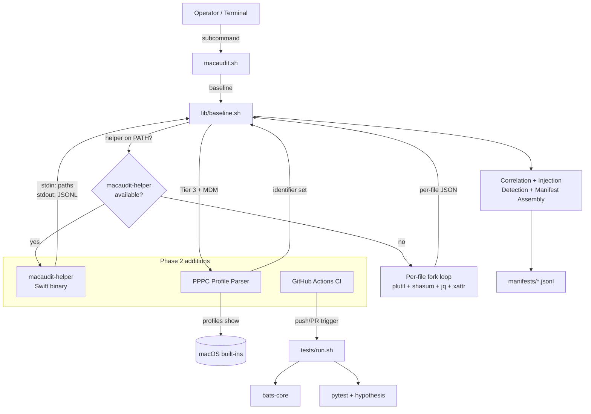
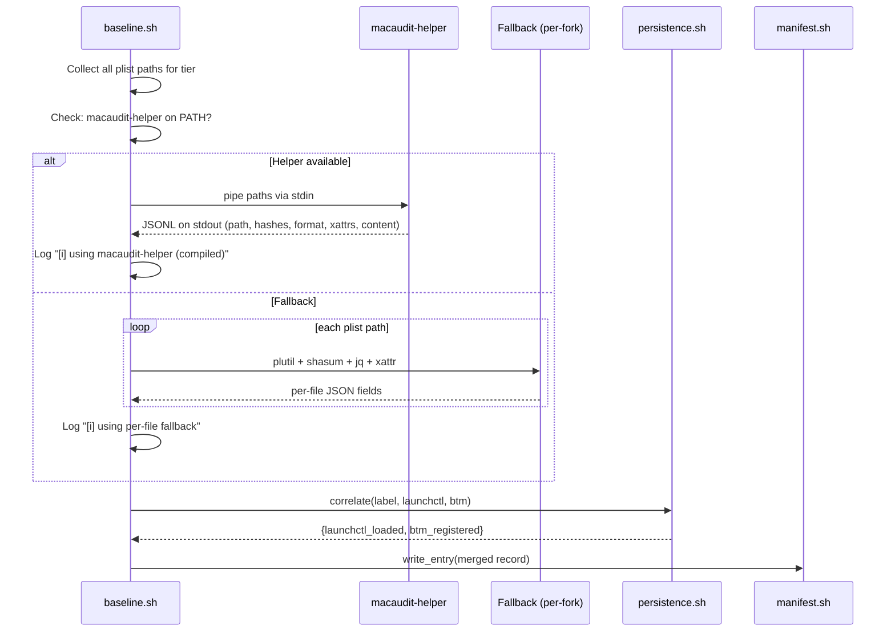
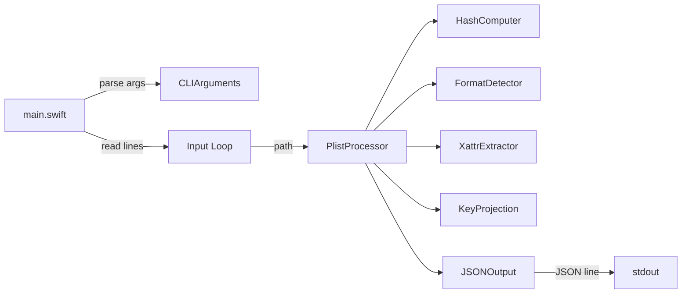

# Design Document: macaudit Phase 2

## Overview

Phase 2 extends macaudit with three independent priorities that address performance, accuracy, and reliability gaps identified during Phase 1 deployment. This design is additive to the Phase 1 design (`.kiro/specs/macaudit/design.md`); all Phase 1 architecture, data models, correctness properties (P1–P25), and module responsibilities remain in force.

**Priority 1 — Compiled Swift helper (`macaudit-helper`):** Replaces the per-file fork loop in `baseline.sh` (which forks `plutil` + `shasum` + `jq` + `xattr` per plist, ~170ms/entry) with a single compiled binary invocation that processes all plist paths as a batch. The helper computes dual hashes, detects plist format, extracts xattrs, and optionally projects launch keys or security-critical keys — emitting one JSON object per line on stdout. The Bash layer retains ownership of correlation, injection detection, and manifest assembly. When the helper is absent, the existing per-fork loop runs unchanged (fallback mode).

**Priority 2 — Real PPPC profile parsing:** Replaces the `_baseline_pppc_payloads_json` stub (which returns `MACAUDIT_PPPC_JSON` or `[]`) with a real parser that extracts `com.apple.TCC.configuration-profile-policy` payload identifiers from `profiles show -type configuration` output. This makes the R1 correlation rule (`tcc_mdm_without_profile`) production-ready by eliminating false positives on MDM-managed devices.

**Priority 3 — CI pipeline:** A GitHub Actions workflow on `macos-14` runners that runs the full test suite (bats + pytest) on every push and PR, with an optional performance job.

**Cross-cutting — Manifest version compatibility (Req 45):** Phase 2 baselines remain backward-compatible with Phase 1 tooling. The `manifest_version` bumps to `"1.2"` only when Phase 2-specific fields are present; Phase 1 manifests (`"1.0"`, `"1.1"`) continue to be accepted.

### Design Decisions

| Decision | Rationale |
|---|---|
| Swift helper is a separate binary, not a dylib or embedded script | Keeps the Bash tool self-contained; the helper is an optional accelerator. No FFI complexity. |
| Helper communicates via stdin/stdout JSONL | Matches the existing manifest format. No IPC, no temp files, no sockets. Bash can pipe paths in and parse results with `jq`. |
| Helper depends only on Apple frameworks (Foundation, CryptoKit) | Zero third-party dependencies means no package resolution step. Builds with just `swift build`. |
| PPPC parser is implemented in Bash (not Swift) | The parser runs once per baseline (not per-file), so fork cost is irrelevant. Keeping it in Bash avoids coupling the helper to MDM-specific logic. |
| CI uses `macos-14` runners | Matches the macOS 13+ (Ventura) platform target. GitHub Actions provides these runners without secrets or special setup. |
| Fallback mode is the default | The tool must work on systems without Swift toolchain. The helper is an optimization, not a requirement. |

## Architecture

### Phase 2 System Context (extends Phase 1)



### Helper Integration into baseline.sh

The helper replaces only the per-file computation loop (Sections 2 and 3 of `baseline.sh`). The surrounding orchestration — launchctl/BTM snapshot, injection detection, cfprefsd cross-reference, header finalization, and atomic write — remains unchanged.



### Helper Discovery Order

1. `macaudit-helper` on `$PATH` (preferred — operator installed it system-wide)
2. `macaudit/helper/.build/release/macaudit-helper` (local build from source)
3. Neither found → fallback mode

## Components and Interfaces

### macaudit-helper (new — Swift binary)

**Purpose**: Batch plist processing accelerator. Reads plist paths, emits per-file JSON with dual hashes, format, xattrs, and optional key projection.

**CLI Interface**:

```
macaudit-helper [OPTIONS]

OPTIONS:
  --input <file>                Read paths from file instead of stdin
  --projection launch-keys      Include Tier 1 launch-key content
  --projection security-keys    Include security-critical key content
  --domain <domain>             Domain for security-keys projection
  --version                     Print version and exit
  --help                        Print usage and exit

STDIN:
  One absolute file path per line, UTF-8, newline-terminated.

STDOUT:
  One compact JSON object per line (JSONL), UTF-8, newline-terminated.
  Output order matches input order: line N of output corresponds to line N of input.

EXIT CODES:
  0 — all paths processed (per-file errors reported inline as JSON)
  1 — fatal error (invalid arguments, stdin read failure)
```

**Output JSON Schema** (per line):

```json
{
  "path": "/absolute/path/to/file.plist",
  "sha256_raw": "a1b2c3...64hex...",
  "sha256_canonical": "d4e5f6...64hex...",
  "format": "binary|xml|json|invalid",
  "size_bytes": 1024,
  "mtime": "2026-04-27T18:00:00Z",
  "xattrs": {"com.apple.quarantine": "base64..."},
  "content": {"Label": "com.example", ...}
}
```

On per-file error:

```json
{
  "path": "/nonexistent/file.plist",
  "error": "File not found",
  "sha256_raw": "",
  "sha256_canonical": "",
  "format": "invalid"
}
```

### Package.swift Structure

```
macaudit/helper/
├── Package.swift
├── Sources/
│   └── macaudit-helper/
│       ├── main.swift              # Entry point, argument parsing, stdin/stdout loop
│       ├── PlistProcessor.swift    # Core: read plist, compute hashes, detect format
│       ├── HashComputer.swift      # CryptoKit SHA-256 wrappers
│       ├── XattrExtractor.swift    # Extended attribute reading via listxattr/getxattr
│       ├── KeyProjection.swift     # Launch-key and security-key filtering
│       ├── JSONOutput.swift        # Codable output model + JSONL serialization
│       └── FormatDetector.swift    # Binary/XML/JSON/invalid detection via magic bytes
└── Tests/
    └── macaudit-helperTests/
        └── PlistProcessorTests.swift
```

**Package.swift**:

```swift
// swift-tools-version: 5.9
import PackageDescription

let package = Package(
    name: "macaudit-helper",
    platforms: [.macOS(.v13)],
    targets: [
        .executableTarget(
            name: "macaudit-helper",
            path: "Sources/macaudit-helper"
        ),
        .testTarget(
            name: "macaudit-helperTests",
            dependencies: ["macaudit-helper"],
            path: "Tests/macaudit-helperTests"
        )
    ]
)
```

No external dependencies. Only Apple platform frameworks: `Foundation` (plist deserialization, JSON serialization), `CryptoKit` (SHA-256), and POSIX C APIs (`listxattr`, `getxattr`) via the Swift standard library.

### Swift Helper Internal Architecture



**PlistProcessor** is the core orchestrator per file:

```
ALGORITHM process_plist(path, projection)
INPUT:  path — absolute path string; projection — none | launch-keys | security-keys(domain)
OUTPUT: JSON object on stdout

BEGIN
  IF NOT file_exists(path) OR NOT file_readable(path) THEN
    emit_error_json(path, "File not found or unreadable")
    RETURN
  END IF

  bytes ← read_file_bytes(path)       // follows symlinks
  sha256_raw ← SHA256.hash(bytes).hexString

  format ← detect_format(bytes)       // magic-byte inspection

  // Canonical hash: deserialize plist, re-serialize as sorted-keys JSON
  plist_obj ← try PropertyListSerialization.propertyList(from: bytes)
  IF plist_obj == nil THEN
    emit_json(path, sha256_raw, "", "invalid", size, mtime, xattrs, {})
    RETURN
  END IF

  canonical_json ← JSONSerialization.data(plist_obj, options: [.sortedKeys])
  sha256_canonical ← SHA256.hash(canonical_json).hexString

  xattrs ← extract_xattrs(path)       // listxattr + getxattr + base64

  content ← {}
  IF projection == launch-keys THEN
    content ← filter_keys(plist_obj, LAUNCH_KEY_SET)
  ELSE IF projection == security-keys(domain) THEN
    content ← filter_keys(plist_obj, SECURITY_KEY_MAP[domain])
  END IF

  emit_json(path, sha256_raw, sha256_canonical, format, size, mtime, xattrs, content)
END
```

### lib/baseline.sh (amended — helper integration)

**New internal functions**:

```bash
# _baseline_helper_available
#   Returns 0 if macaudit-helper is found on PATH or at the local build path.
#   Sets MACAUDIT_HELPER_PATH to the resolved binary path.
_baseline_helper_available()

# _baseline_process_via_helper <paths_file> <projection> [<domain>] <output_file>
#   Pipes paths from <paths_file> to macaudit-helper, writes JSONL to <output_file>.
#   Returns 0 on success, 2 on fatal helper error.
_baseline_process_via_helper()

# _baseline_process_via_fallback <paths_file> <projection> [<domain>] <output_file>
#   Existing per-file fork loop. Unchanged from Phase 1.
_baseline_process_via_fallback()
```

The Tier 1 and Tier 2 walk functions (`_baseline_tier1_walk`, `_baseline_tier2_walk`) are amended to:
1. Collect all plist paths into a scratch file first.
2. Call `_baseline_helper_available` once.
3. Dispatch to `_baseline_process_via_helper` or `_baseline_process_via_fallback`.
4. Merge helper/fallback output with correlation fields (launchctl, BTM, cfprefsd) as before.

### PPPC Profile Parser (new — Bash functions in lib/baseline.sh)

**New functions**:

```bash
# _baseline_pppc_parse_profiles <profiles_xml>
#   Parses XML plist output from `profiles show -type configuration`.
#   Extracts all PPPC payload identifiers.
#   stdout: JSON array of unique identifier strings.
_baseline_pppc_parse_profiles()

# _baseline_pppc_pretty_print <service_identifier_pairs_json>
#   Accepts JSON array of {"service": "...", "identifier": "..."} objects.
#   stdout: Valid XML plist fragment matching PPPC payload Services structure.
#   Used by round-trip property tests.
_baseline_pppc_pretty_print()

# _baseline_pppc_payloads_json  (replaces Phase 1 stub)
#   Override precedence:
#     1. MACAUDIT_PPPC_JSON (highest) — use directly
#     2. PROFILES_SHOW_OVERRIDE — read file, parse
#     3. Live `profiles show -type configuration` — invoke, parse
#   stdout: JSON array of unique identifier strings.
_baseline_pppc_payloads_json()
```

### PPPC Parser Algorithm

```
ALGORITHM pppc_parse_profiles(xml_input)
INPUT:  xml_input — XML plist string from `profiles show -type configuration`
OUTPUT: deduplicated array of PPPC identifier strings

PRECONDITIONS:
  - xml_input is either valid XML plist or empty/malformed (handled gracefully)

POSTCONDITIONS:
  - Output contains every Identifier from every Services entry of every
    com.apple.TCC.configuration-profile-policy payload
  - Output is deduplicated (set semantics)
  - Malformed input → empty array + warning on stderr

BEGIN
  IF xml_input is empty THEN
    RETURN []
  END IF

  // Parse XML plist into a dictionary structure using plutil
  // The profiles show output is an XML plist with structure:
  //   _computerlevel (array of profile dicts)
  //     each profile dict has PayloadContent (array of payload dicts)
  //       each payload dict has PayloadType and (for PPPC) Services dict
  //         Services dict maps service names to arrays of entry dicts
  //           each entry dict has Identifier (string)

  parsed ← plutil_to_json(xml_input)
  IF parsed is invalid THEN
    log_warn "PPPC: profiles output is not valid XML plist"
    RETURN []
  END IF

  identifiers ← empty_set()

  // Iterate over all profile levels (_computerlevel, _userlevel)
  FOR each level IN [_computerlevel, _userlevel] DO
    profiles ← parsed[level]
    IF profiles is not array THEN CONTINUE END IF

    FOR each profile IN profiles DO
      payload_content ← profile.PayloadContent
      IF payload_content is not array THEN CONTINUE END IF

      FOR each payload IN payload_content DO
        IF payload.PayloadType ≠ "com.apple.TCC.configuration-profile-policy" THEN
          CONTINUE
        END IF

        services ← payload.Services
        IF services is not dict OR services is empty THEN
          CONTINUE
        END IF

        FOR each service_key IN keys(services) DO
          entries ← services[service_key]
          IF entries is not array THEN CONTINUE END IF

          FOR each entry IN entries DO
            id ← entry.Identifier
            IF id is not string OR id is empty THEN
              log_warn "PPPC: service entry missing Identifier in " + service_key
              CONTINUE
            END IF
            identifiers.add(id)
          END FOR
        END FOR
      END FOR
    END FOR
  END FOR

  RETURN sorted(identifiers)   // sorted for deterministic output
END
```

**Implementation approach**: The Bash implementation pipes the XML through `plutil -convert json -o - -` to get JSON, then uses `jq` to traverse the structure:

```bash
_baseline_pppc_parse_profiles() {
  local xml_input="$1"
  printf '%s' "$xml_input" \
    | plutil -convert json -o - - 2>/dev/null \
    | jq -c '
        [
          (._computerlevel // []),
          (._userlevel // [])
        ] | add // []
        | [.[].PayloadContent // [] | .[]
           | select(.PayloadType == "com.apple.TCC.configuration-profile-policy")
           | .Services // {}
           | to_entries[].value[]
           | .Identifier // empty
          ]
        | unique
      ' 2>/dev/null || printf '[]'
}
```

### PPPC Pretty-Printer Algorithm

```
ALGORITHM pppc_pretty_print(pairs)
INPUT:  pairs — array of {service: string, identifier: string} objects
OUTPUT: valid XML plist fragment matching PPPC payload Services structure

BEGIN
  // Build Services dict: group identifiers by service key
  services ← empty_map()
  FOR each pair IN pairs DO
    IF pair.service NOT IN services THEN
      services[pair.service] ← []
    END IF
    services[pair.service].append(pair.identifier)
  END FOR

  // Emit XML plist
  xml ← '<?xml version="1.0" encoding="UTF-8"?>'
  xml += '<!DOCTYPE plist PUBLIC "-//Apple//DTD PLIST 1.0//EN" ...>'
  xml += '<plist version="1.0"><dict>'
  xml += '<key>PayloadContent</key><array><dict>'
  xml += '<key>PayloadType</key>'
  xml += '<string>com.apple.TCC.configuration-profile-policy</string>'
  xml += '<key>Services</key><dict>'

  FOR each service_key IN sorted(keys(services)) DO
    xml += '<key>' + xml_escape(service_key) + '</key><array>'
    FOR each id IN services[service_key] DO
      xml += '<dict><key>Identifier</key>'
      xml += '<string>' + xml_escape(id) + '</string></dict>'
    END FOR
    xml += '</array>'
  END FOR

  xml += '</dict></dict></array></dict></plist>'
  RETURN xml
END
```

### CI Workflow Structure

**File**: `.github/workflows/test.yml`

```yaml
name: macaudit CI

on:
  push:
    branches: [main, master]
  pull_request:
    branches: [main, master]

jobs:
  test:
    runs-on: macos-14
    steps:
      # 1. Checkout repository
      - uses: actions/checkout@v4

      # 2. Cache Homebrew downloads
      - uses: actions/cache@v4
        with:
          path: ~/Library/Caches/Homebrew
          key: brew-${{ runner.os }}-${{ hashFiles('.github/workflows/test.yml') }}
          restore-keys: brew-${{ runner.os }}-

      # 3. Cache pip packages
      - uses: actions/cache@v4
        with:
          path: ~/Library/Caches/pip
          key: pip-${{ runner.os }}-${{ hashFiles('.github/workflows/test.yml') }}
          restore-keys: pip-${{ runner.os }}-

      # 4. Install Homebrew dependencies (bats-core, jq)
      - name: Install Homebrew dependencies
        run: brew install bats-core jq

      # 5. Install Python test dependencies (hypothesis, pytest)
      - name: Install Python test dependencies
        run: pip3 install hypothesis pytest

      # 6. Run the full test suite
      - name: Run tests
        run: bash macaudit/tests/run.sh
        working-directory: .

  perf:
    needs: test
    runs-on: macos-14
    continue-on-error: true
    steps:
      - uses: actions/checkout@v4

      - name: Install dependencies
        run: |
          brew install bats-core jq
          pip3 install hypothesis pytest

      # Performance harness with relaxed CI target (default 60s)
      - name: Run performance harness
        run: bash macaudit/tests/run.sh --perf
        env:
          MACAUDIT_PERF_TARGET_SECONDS: 60
```

## Data Models

### Helper Output JSON Schema

Each line of the helper's stdout is a JSON object conforming to one of two shapes:

**Success shape** (valid plist processed):

```json
{
  "path": "/Library/LaunchDaemons/com.example.plist",
  "sha256_raw": "a1b2c3d4e5f6...64 hex chars",
  "sha256_canonical": "f6e5d4c3b2a1...64 hex chars",
  "format": "binary",
  "size_bytes": 1024,
  "mtime": "2026-04-27T18:00:00Z",
  "xattrs": {
    "com.apple.quarantine": "MDAwMTsxNzE0MjAwMDAw..."
  },
  "content": {
    "Label": "com.example",
    "ProgramArguments": ["/usr/local/bin/example"],
    "RunAtLoad": true
  }
}
```

**Error shape** (file not found, unreadable, corrupt):

```json
{
  "path": "/nonexistent/file.plist",
  "error": "No such file or directory",
  "sha256_raw": "",
  "sha256_canonical": "",
  "format": "invalid"
}
```

**Validation rules**:
- `path` is always present and matches the input line.
- `sha256_raw` and `sha256_canonical` are lowercase 64-hex or empty string.
- `format` ∈ {`binary`, `xml`, `json`, `invalid`}.
- `content` is present only when `--projection` is specified and the file is a valid plist.
- `error` is present only on per-file errors; mutually exclusive with `sha256_canonical` being non-empty.
- `xattrs` is a JSON object (may be empty `{}`); each value is base64-encoded.
- `mtime` is ISO 8601 UTC.

### PPPC Identifier Set

The PPPC parser produces a JSON array of unique bundle identifier strings:

```json
["com.example.app", "com.vendor.daemon", "org.mozilla.firefox"]
```

This array is stored in the manifest header's `environment` block as `pppc_profile_payload_identifiers` and consumed by the R1 correlation rule.

**Validation rules**:
- Array is sorted lexicographically for deterministic output.
- No duplicates (set semantics).
- Each element is a non-empty string (typically a reverse-DNS bundle identifier).
- Empty array is valid (no PPPC profiles installed, non-MDM device, or parse failure).

### Manifest Header (Phase 2 amendment)

When Phase 2-specific data is present, `manifest_version` bumps to `"1.2"`:

```json
{
  "manifest_version": "1.2",
  "tool_version": "0.2.0-phase2",
  "environment": {
    "fda_available": true,
    "has_sudo": true,
    "gatekeeper_enabled": true,
    "mdm_managed": true,
    "xprotect_version": "5295",
    "pppc_profile_payload_identifiers": ["com.example.app", "com.vendor.daemon"],
    "helper_used": true,
    "helper_version": "0.2.0"
  }
}
```

New fields in `environment`:
- `pppc_profile_payload_identifiers`: The PPPC identifier set (array of strings).
- `helper_used`: Boolean indicating whether the Swift helper was used for this run.
- `helper_version`: Version string of the helper binary (present only when `helper_used` is true).

**Version compatibility rules**:
- Phase 2 tool accepts `manifest_version` ∈ {`"1.0"`, `"1.1"`, `"1.2"`}.
- Phase 1 tool rejects `manifest_version: "1.2"` with a clear error (per existing Req 18.2).
- Absent Phase 2 fields are treated as defaults: `pppc_profile_payload_identifiers` → `[]`, `helper_used` → `false`.

### Security-Critical Key Map (unchanged)

The key map from Phase 1 is unchanged. The helper receives the key set via `--projection security-keys --domain <domain>` and filters accordingly. The canonical key map remains in `lib/surfaces.sh`.

### Launch Key Set (unchanged)

The Tier 1 launch-key set from Phase 1 is unchanged: `Label`, `Program`, `ProgramArguments`, `RunAtLoad`, `KeepAlive`, `WatchPaths`, `StartInterval`, `StartCalendarInterval`, `MachServices`, `Sockets`, `UserName`, `GroupName`. The helper receives this via `--projection launch-keys`.


## Correctness Properties

*A property is a characteristic or behavior that should hold true across all valid executions of a system — essentially, a formal statement about what the system should do. Properties serve as the bridge between human-readable specifications and machine-verifiable correctness guarantees.*

Phase 2 properties are numbered P25+ to continue from Phase 1's P1–P24 (including the Tier 3 amendment properties P16–P24). All Phase 1 properties remain in force.

### Property 25: Helper hash equivalence

*For any* valid plist file `f` (binary, XML, or JSON format), the macaudit-helper's `sha256_raw` output SHALL be byte-identical to `shasum -a 256 < f | awk '{print $1}'`, and the macaudit-helper's `sha256_canonical` output SHALL be byte-identical to `plutil -convert json -o - f | jq -cS '.' | shasum -a 256 | awk '{print $1}'`, and the macaudit-helper's `format` output SHALL agree with Phase 1's format detection logic, and the macaudit-helper's `xattrs` output SHALL be identical to Phase 1's `xattr -l` + base64 encoding pipeline.

**Validates: Requirements 30.4, 30.5, 30.6, 30.7, 31.1, 31.2, 31.3, 31.4**

### Property 26: Helper output schema completeness

*For any* valid plist path provided as input, the macaudit-helper's output JSON SHALL contain all required fields: `path`, `sha256_raw`, `sha256_canonical`, `format`, `size_bytes`, `mtime`, and `xattrs`, each with the correct type (string, number, or object).

**Validates: Requirements 30.3**

### Property 27: Helper order and count preservation

*For any* list of N plist paths provided as input (via stdin or `--input`), the macaudit-helper SHALL emit exactly N JSON lines on stdout, and the Nth output line's `path` field SHALL equal the Nth input line.

**Validates: Requirements 30.1, 47.3**

### Property 28: Launch-key projection scope

*For any* plist file `f` processed with `--projection launch-keys`, the `content` field in the output SHALL contain only keys from the Tier 1 launch-key set (`Label`, `Program`, `ProgramArguments`, `RunAtLoad`, `KeepAlive`, `WatchPaths`, `StartInterval`, `StartCalendarInterval`, `MachServices`, `Sockets`, `UserName`, `GroupName`), and no other keys from the original plist SHALL appear in `content`.

**Validates: Requirements 30.8**

### Property 29: Security-key projection scope

*For any* plist file `f` and domain `d` processed with `--projection security-keys --domain d`, the `content` field in the output SHALL contain only keys from the security-critical key map for domain `d`, and no other keys from the original plist SHALL appear in `content`.

**Validates: Requirements 30.9**

### Property 30: Fallback equivalence

*For any* set of plist files processed during a baseline run, the manifest output (after `jq -cS` normalization of each entry) SHALL be identical regardless of whether the Swift helper or the per-file Bash fallback produced the per-file fields. Specifically, for each entry, the `(path, sha256_raw, sha256_canonical, format, size_bytes, xattrs, content)` tuple SHALL be equal across both code paths.

**Validates: Requirements 31.5, 34.3**

### Property 31: Helper read-only invariant

*For any* input path `p` processed by the macaudit-helper, the byte content of `p` SHALL be identical before and after processing. Formally: `sha256(read_bytes(p, before)) == sha256(read_bytes(p, after))`.

**Validates: Requirements 33.1, 33.4**

### Property 32: PPPC round-trip

*For any* list of `(service_key, identifier)` pairs `L`, pretty-printing `L` into an XML plist fragment via `_baseline_pppc_pretty_print` and then parsing that fragment via `_baseline_pppc_parse_profiles` SHALL produce an identifier set equal to the set of identifiers in `L`.

**Validates: Requirements 40.1, 40.2, 40.3**

### Property 33: PPPC extraction completeness

*For any* valid `profiles show -type configuration` XML plist containing N PPPC payloads (PayloadType = `com.apple.TCC.configuration-profile-policy`) with M total `Identifier` values across all `Services` entries, the parser SHALL extract a deduplicated set containing every unique identifier. No identifier present in the input SHALL be absent from the output, and no identifier absent from the input SHALL appear in the output.

**Validates: Requirements 36.2, 36.3, 36.4, 37.6**

### Property 34: R1 correlation accuracy

*For any* TCC `access` row with `auth_reason = 6` and any PPPC identifier set `S`, the R1 correlation rule SHALL emit a `tcc_mdm_without_profile` finding if and only if the row's `client` field is NOT present in `S`. Equivalently: `finding_emitted(row) ⟺ row.client ∉ S`.

**Validates: Requirements 39.1, 39.2, 39.3**

### Property 35: Manifest version backward compatibility

*For any* valid manifest with `manifest_version` ∈ {`"1.0"`, `"1.1"`}, the Phase 2 `audit` and `integrity` subcommands SHALL accept and process the manifest without error, treating absent Phase 2 fields as their default values.

**Validates: Requirements 45.1, 45.4**

### Property 36: Helper robustness

*For any* well-formed input line (including empty strings, paths with special characters, paths to symlinks, paths to zero-byte files, and paths to non-existent files), the macaudit-helper SHALL not crash (no segfault, no unhandled exception) and SHALL emit either a valid success JSON or a valid error JSON on stdout.

**Validates: Requirements 46.3**

## Error Handling

### Scenario: macaudit-helper not on PATH

**Condition**: `macaudit-helper` binary not found on PATH or at local build path.
**Response**: Log `[i] using per-file fallback (no macaudit-helper on PATH)` to stderr. Fall back to existing per-file fork loop. No change in output.
**Recovery**: Operator builds or installs the helper for performance improvement.

### Scenario: macaudit-helper crashes or exits non-zero

**Condition**: Helper binary exits with non-zero code during batch processing.
**Response**: Log `[!] macaudit-helper failed (exit N); falling back to per-file mode` to stderr. Re-process all paths via the fallback loop. Manifest output is still correct.
**Recovery**: Operator investigates helper crash; tool continues to function via fallback.

### Scenario: Helper emits per-file error JSON

**Condition**: A specific plist path is unreadable, corrupt, or missing.
**Response**: Helper emits error JSON for that path (with `error` field, empty hashes, `format: "invalid"`). `baseline.sh` records the path in `skipped_paths` with the error reason. Other paths continue processing.
**Recovery**: Operator investigates the specific file.

### Scenario: `profiles show` unavailable or fails

**Condition**: `profiles` binary not found, or `profiles show -type configuration` exits non-zero.
**Response**: Log `[!] PPPC: profiles command unavailable or failed; using empty identifier set` to stderr. Set `pppc_profile_payload_identifiers` to `[]`. R1 rule fires for all `auth_reason=6` rows (preserving Phase 1 behavior).
**Recovery**: Operator verifies MDM enrollment and profiles binary availability.

### Scenario: `profiles show` output is not valid XML plist

**Condition**: Output from `profiles show` cannot be parsed by `plutil -convert json`.
**Response**: Log `[!] PPPC: profiles output is not valid XML plist; using empty identifier set` to stderr. Set identifiers to `[]`.
**Recovery**: Operator investigates profiles output manually.

### Scenario: PROFILES_SHOW_OVERRIDE points to non-existent file

**Condition**: Environment variable set but file does not exist.
**Response**: Log `[!] PPPC: PROFILES_SHOW_OVERRIDE file not found; using empty identifier set` to stderr. Set identifiers to `[]`.
**Recovery**: Operator corrects the override path.

### Scenario: Phase 1 tool receives manifest_version "1.2"

**Condition**: A Phase 2 manifest is passed to a Phase 1 tool.
**Response**: Phase 1 tool rejects with `[x] baseline version 1.2 not supported by this tool (expected 1.0 or 1.1)`; exit 2. (This is existing behavior from Req 18.2.)
**Recovery**: Operator uses Phase 2 tool or re-baselines with Phase 1.

### Scenario: Zero-byte plist file

**Condition**: Helper receives a path to a zero-byte file.
**Response**: Emit JSON with `sha256_raw` = `e3b0c44298fc1c149afbf4c8996fb92427ae41e4649b934ca495991b7852b855` (SHA-256 of empty input), `sha256_canonical` = `""`, `format` = `"invalid"`.
**Recovery**: None required; the entry is recorded accurately.

### Scenario: Symlink input to helper

**Condition**: Input path is a symlink.
**Response**: Helper follows the symlink and processes the target file. Output `path` field contains the original symlink path (not the resolved target).
**Recovery**: None required.

## Testing Strategy

### Dual Testing Approach

Phase 2 uses the same dual testing approach as Phase 1:
- **Unit tests (bats)**: Verify specific examples, edge cases, error conditions, and integration points.
- **Property tests (hypothesis)**: Verify universal properties across randomized inputs.

### Property-Based Testing Configuration

**Library**: Python 3 + `hypothesis` (same as Phase 1).

**Configuration**: Minimum 100 iterations per property test. Each test is tagged with a comment referencing the design property.

**Tag format**: `Feature: macaudit-phase2, Property {number}: {property_text}`

### Property Test Plan

| Property | Test File | Generator Strategy |
|---|---|---|
| P25: Hash equivalence | `test_p25_hash_equivalence.py` | Generate random plist content (dicts, arrays, strings, numbers, dates, data blobs) via `plistlib`. Write as binary, XML, and JSON. Invoke helper and Bash pipeline, compare all four fields. |
| P26: Schema completeness | `test_p26_schema_completeness.py` | Generate random valid plists. Invoke helper. Assert all required fields present with correct types. |
| P27: Order preservation | `test_p27_order_preservation.py` | Generate random lists of plist paths (1–100 paths). Invoke helper. Assert output[i].path == input[i] and len(output) == len(input). |
| P28: Launch-key projection | `test_p28_launch_key_projection.py` | Generate plists with random keys including launch keys and non-launch keys. Invoke with `--projection launch-keys`. Assert content keys ⊆ launch key set. |
| P29: Security-key projection | `test_p29_security_key_projection.py` | Generate plists with random keys for each known domain. Invoke with `--projection security-keys --domain X`. Assert content keys ⊆ domain key set. |
| P30: Fallback equivalence | `test_p30_fallback_equivalence.py` | Generate random plists. Run baseline with helper on PATH and without. Compare manifest entries field-by-field after `jq -cS` normalization. |
| P31: Read-only invariant | `test_p31_read_only.py` | Generate random plists. Record SHA-256 before helper invocation. Invoke helper. Verify SHA-256 unchanged after. |
| P32: PPPC round-trip | `test_p32_pppc_round_trip.py` | Generate random lists of (service_key, identifier) pairs. Pretty-print to XML. Parse back. Assert identifier set equality. |
| P33: PPPC extraction | `test_p33_pppc_extraction.py` | Generate random profiles XML with varying PPPC payloads, service keys, and identifiers (including duplicates). Parse. Assert output == deduplicated union of input identifiers. |
| P34: R1 correlation | `test_p34_r1_correlation.py` | Generate random TCC rows with auth_reason=6 and random identifier sets. Run R1 rule. Assert finding emitted iff client ∉ identifier set. |
| P35: Version compat | `test_p35_version_compat.py` | Generate random manifests with version "1.0" and "1.1". Pass to Phase 2 audit/integrity. Assert no error. |
| P36: Helper robustness | `test_p36_helper_robustness.py` | Generate random inputs: empty strings, paths with unicode/special chars, symlinks, zero-byte files, non-existent paths. Invoke helper. Assert no crash and valid JSON output. |

### Unit Test Plan (bats)

New bats test files for Phase 2:

| Test File | Coverage |
|---|---|
| `tests/bats/helper_integration.bats` | Helper discovery, fallback logging, helper invocation, error recovery |
| `tests/bats/pppc_parser.bats` | PPPC parsing edge cases: empty profiles, missing Identifier, empty Services, invalid XML, override precedence |
| `tests/bats/pppc_pretty_print.bats` | Pretty-printer output validity (plutil -lint), round-trip with parser |
| `tests/bats/manifest_version.bats` | Version "1.0", "1.1", "1.2" acceptance/rejection, version bump logic |
| `tests/bats/helper_cli.bats` | `--version`, `--help`, `--input`, `--projection` flags, fatal error exit codes |

### Integration Test Plan

| Scenario | Description |
|---|---|
| Helper vs fallback equivalence | Run baseline with and without helper on PATH over fixture plists; diff manifests |
| PPPC + R1 end-to-end | Inject PROFILES_SHOW_OVERRIDE with known PPPC payloads; run baseline with Tier 3; verify R1 findings match expected |
| CI workflow validation | Push to a test branch; verify GitHub Actions workflow triggers and passes |
| Existing suite regression | Run full bats + pytest suite with helper absent (fallback) and present (accelerated) |

### Performance Test Plan

The existing `tests/perf/run.sh` harness is extended to:
1. Run with helper on PATH → assert < 30s for 3000 entries.
2. Run without helper (fallback) → report time but do not assert (fallback is expected to be slower).
3. Run helper standalone → assert < 10s for 3000 entries.

The CI performance job uses a relaxed 60-second target to account for runner variability.
