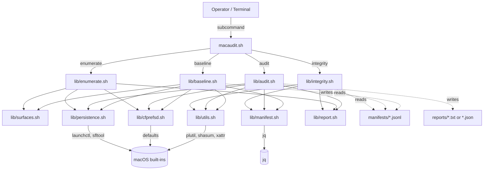
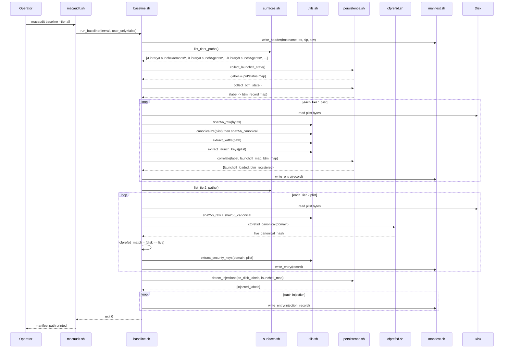
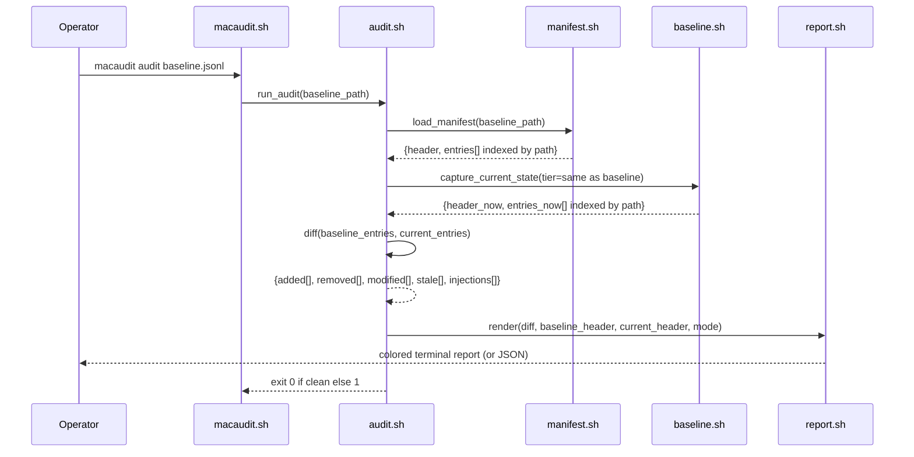

# Design Document: macaudit — macOS Forensic System Configuration Auditor (Phase 1)

## Overview

macaudit is a terminal-based, read-only macOS forensic tool that captures a baseline snapshot of system configuration state and compares future snapshots against that baseline to detect drift, additions, removals, and integrity failures. It is the macOS equivalent of a Windows registry checker combined with a CRC file integrity comparator, adapted to the reality that macOS distributes configuration across thousands of plist files, SQLite databases, and code-signed bundles rather than consolidating into a single registry hive.

Phase 1 is a Bash prototype targeting macOS 13+ (Ventura and later, including Sequoia 15.x). It covers two audit surfaces: Tier 1 (persistence mechanisms — LaunchAgents, LaunchDaemons, login items, cron, periodic, hooks, authorization plugins, emond rules) and Tier 2 (preference domains — system, user, and managed preferences with dual-hash verification and cfprefsd cross-reference). The tool treats the mutable Data volume as the single logical configuration surface and never touches the Sealed System Volume, which is verified by Apple's SSV hash tree at boot.

The core architectural pattern is baseline → compare → report. Baselines are serialized as JSONL manifests (one record per line) for streaming, grep-ability, and diffability with standard Unix tools. Every plist entry carries two SHA-256 hashes — one over raw file bytes and one over a canonical JSON representation — so the tool can distinguish semantic changes from format-only changes (binary↔XML↔JSON conversions). Persistence entries carry three-view correlation flags (on-disk + launchctl + BTM) so in-memory injections and staged persistence become first-class findings. The tool uses only macOS built-in utilities plus `jq`; it never modifies system state, never accesses the network, and degrades gracefully when run without sudo.

## Architecture

### System Context



### Module Responsibilities

| Module | Responsibility |
|---|---|
| `macaudit.sh` | CLI entry point. Parses global flags, dispatches to subcommand handlers, sets exit codes, prints usage/help. |
| `lib/surfaces.sh` | Canonical definitions of Tier 1 and Tier 2 path lists, per-domain security-critical key maps, tier membership predicates. |
| `lib/utils.sh` | Shared primitives: SHA-256 hashing, plist format detection, canonical JSON conversion, xattr extraction, temp-dir lifecycle, color/tty detection, logging, sudo detection, OS version guard. |
| `lib/baseline.sh` | Walks audit surfaces, produces one manifest entry per artifact, writes JSONL. Emits header line with environment metadata. |
| `lib/audit.sh` | Loads stored baseline, re-captures current state, computes set-difference (added/removed/modified/stale), hands results to reporter. |
| `lib/integrity.sh` | Re-hashes every file referenced in a baseline, classifies each as PASS / FAIL / MISSING / NEW, reports which hash channel (raw vs canonical) changed. |
| `lib/enumerate.sh` | One-shot, baseline-free dump of current persistence and/or preference state for reconnaissance. |
| `lib/cfprefsd.sh` | Disk-vs-live preference cross-reference. Exports domain via `defaults export`, computes canonical hash, compares to on-disk canonical hash. |
| `lib/persistence.sh` | Three-view correlation: on-disk plist list, `launchctl list` output, `sfltool dumpbtm` output. Produces `launchctl_loaded` and `btm_registered` flags and detects injection. |
| `lib/manifest.sh` | JSONL read/write helpers. Header serialization. Per-entry path-keyed indexing via associative arrays (bash 4+) or sorted sequential scan (bash 3.2 fallback). |
| `lib/report.sh` | Terminal formatting: category symbols, colors, delta rendering, summary. Has human and `--json` modes. |

### Control Flow: `macaudit baseline --tier all`



### Control Flow: `macaudit audit <baseline>`



## Components and Interfaces

### macaudit.sh (entry point)

**Purpose**: Parse global flags and dispatch to subcommand handlers.

**Interface (Bash functions)**:

```bash
# Top-level dispatch
main()                                  # argv router
print_usage()                           # stdout: human usage string
print_version()                         # stdout: "macaudit 0.1.0-phase1"

# Subcommand handlers (one per CLI verb)
cmd_baseline "$@"                       # ./macaudit.sh baseline [--output PATH] [--tier 1|2|all] [--user-only]
cmd_audit    "$@"                       # ./macaudit.sh audit <baseline> [--output PATH] [--json]
cmd_enumerate "$@"                      # ./macaudit.sh enumerate [--persistence] [--preferences] [--all]
cmd_integrity "$@"                      # ./macaudit.sh integrity <baseline>
```

**Responsibilities**:
- Global precondition checks (macOS 13+, bash available, jq available).
- Argument parsing using `while [[ $# -gt 0 ]]; do case "$1" in ... esac; done` pattern.
- Exit code management: 0 clean, 1 drift, 2 error.
- Sources all `lib/*.sh` helpers exactly once.

### lib/surfaces.sh

**Purpose**: Single source of truth for what paths belong to which tier, which domains carry security-critical keys, and what those keys are.

**Interface**:

```bash
# Path enumeration
surfaces_tier1_system_paths()          # echoes \n-separated paths (needs sudo)
surfaces_tier1_user_paths()            # echoes \n-separated paths (no sudo)
surfaces_tier2_system_paths()          # echoes \n-separated paths (needs sudo)
surfaces_tier2_user_paths()            # echoes \n-separated paths (no sudo)
surfaces_tier2_managed_paths()         # echoes \n-separated paths

# Key extraction tables
surfaces_launch_keys()                 # echoes keys: Label ProgramArguments RunAtLoad ...
surfaces_security_keys_for_domain "$domain"
                                       # echoes security-critical keys for a given plist domain

# Predicates
surfaces_tier_of "$path"               # echoes 1 or 2 or empty
surfaces_is_apple_signed_parent "$path"
                                       # heuristic: path prefix under /usr/, /System/, /Library/Apple*
```

**Responsibilities**:
- Hardcode the Tier 1 and Tier 2 path globs.
- Hardcode the security-critical key map from the spec (see Data Models below).
- Provide a single place to extend in future phases.

### lib/utils.sh

**Purpose**: Low-level primitives used by every other module.

**Interface**:

```bash
# Hashing
utils_sha256_file "$path"              # stdout: 64 hex chars, or empty on error
utils_sha256_stdin                     # reads stdin, stdout: 64 hex chars

# Plist format and conversion
utils_plist_format "$path"             # stdout: binary|xml|json|invalid
utils_plist_to_canonical_json "$path"  # stdout: canonical JSON (sorted keys), via plutil
utils_plist_valid "$path"              # exit 0 if plist parses, 1 otherwise

# Attribute extraction
utils_xattrs_json "$path"              # stdout: JSON object {xattr_name: base64_value}
utils_file_size "$path"                # stdout: decimal bytes
utils_file_mtime_iso "$path"           # stdout: ISO 8601 UTC

# Environment
utils_os_version                       # stdout: 15.4 (from sw_vers)
utils_os_major                         # stdout: 15
utils_sip_status                       # stdout: enabled|disabled|unknown (from csrutil)
utils_ssv_status                       # stdout: enabled|disabled|unknown
utils_hostname                         # stdout: hostname
utils_iso_now                          # stdout: ISO 8601 with tz offset
utils_has_sudo                         # exit 0 if running with effective uid 0 or sudo cached
utils_require_bash                     # aborts with message if bash < 3.2

# Terminal
utils_tty_supports_color               # exit 0 if tput colors >= 8 and stdout is tty
utils_color "$name"                    # stdout: tput sequence for red|green|yellow|reset|bold

# Logging
utils_log_info  "$msg"                 # stderr: "[i] $msg"
utils_log_warn  "$msg"                 # stderr: "[!] $msg"
utils_log_err   "$msg"                 # stderr: "[x] $msg"
utils_log_skip  "$path" "$reason"      # stderr: "[skip] $path ($reason)" and accumulates for final summary

# Temp directory lifecycle
utils_tmpdir_init                      # creates ${TMPDIR}/macaudit.$$.XXXX, sets trap
utils_tmpdir_path                      # stdout: current tmpdir
utils_tmpdir_cleanup                   # removes tmpdir; called by EXIT trap
```

**Responsibilities**:
- Encapsulate every external tool invocation so one code path handles errors.
- Normalize output (ISO timestamps, lowercase hex, JSON-safe strings).
- Guarantee temp-dir cleanup via EXIT trap.

### lib/cfprefsd.sh

**Purpose**: Compare a preference domain's on-disk state to its cfprefsd-served live state.

**Interface**:

```bash
cfprefsd_domain_from_path "$path"      # stdout: "com.apple.loginwindow" from /Library/Preferences/com.apple.loginwindow.plist
cfprefsd_live_canonical "$domain" ["$user"]
                                       # stdout: canonical-JSON sha256 of defaults export output
cfprefsd_compare "$disk_canonical_hash" "$live_canonical_hash"
                                       # stdout: true|false; empty if live unavailable
cfprefsd_available                     # exit 0 if `defaults` is usable
```

**Responsibilities**:
- Invoke `defaults export <domain> -` and route through the same canonicalization pipeline as the disk file.
- Return `null` (empty string) when domain is not known to cfprefsd (e.g., `.GlobalPreferences` for a user that doesn't exist).

### lib/persistence.sh

**Purpose**: Three-view correlation for persistence records and injection detection.

**Interface**:

```bash
persistence_collect_launchctl_user     # stdout: tsv "label\tpid\tstatus"
persistence_collect_launchctl_system   # stdout: tsv "label\tpid\tstatus"; needs sudo
persistence_collect_btm                # stdout: jsonl of BTM records; needs sudo; empty on macOS < 13

persistence_correlate "$label" "$launchctl_tsv_path" "$btm_jsonl_path"
                                       # stdout: json object {launchctl_loaded: bool, btm_registered: bool|null}

persistence_detect_injections "$on_disk_labels_path" "$launchctl_tsv_path"
                                       # stdout: \n-separated labels present in launchctl but absent on disk

persistence_extract_label "$plist_path"
                                       # stdout: Label field from plist, or empty
```

**Responsibilities**:
- Cache launchctl and BTM dumps once per run (they are expensive).
- Produce explicit `null` for btm_registered on macOS < 13.
- Injection detection is a pure set difference on `Label` values.

### lib/manifest.sh

**Purpose**: JSONL read/write and in-memory indexing.

**Interface**:

```bash
manifest_write_header "$out_fd" "$header_json"
                                       # prepends header line to manifest file

manifest_write_entry  "$out_fd" "$entry_json"
                                       # appends one JSONL record

manifest_build_entry  \
  --path "$p" --tier "$t" --surface "$s" \
  --format "$fmt" --sha256-raw "$rh" --sha256-canonical "$ch" \
  --size "$sz" --mtime "$mt" --xattrs-json "$xj" \
  --content-json "$cj" \
  --cfprefsd-match "$cm" \
  --launchctl-loaded "$ll" --btm-registered "$bt"
                                       # stdout: one-line JSON entry

manifest_load "$path"                  # stdout: sets MACAUDIT_MANIFEST_HEADER and MACAUDIT_MANIFEST_ENTRIES_FILE (line-indexed scratch file)
manifest_header "$manifest_path"       # stdout: first line (the header JSON)
manifest_entries "$manifest_path"      # stdout: entries (all lines after first), streamable

manifest_entry_by_path "$manifest_path" "$path"
                                       # stdout: matching entry json or empty
```

**Responsibilities**:
- Use `jq -c` for JSON composition so quoting is always correct.
- Never load the full manifest into a bash variable; stream line-by-line so memory stays bounded even for large systems.

### lib/report.sh

**Purpose**: Render a delta (or enumeration) as colored terminal output or JSON.

**Interface**:

```bash
report_render_delta   "$delta_json" "$baseline_header" "$current_header" "$mode"
                                       # mode=human|json; writes to stdout

report_render_enumeration "$enum_json" "$mode"

report_symbol "$category"              # echoes "[+]" / "[-]" / "[~]" / "[!]" / "[?]"
report_color  "$category"              # echoes tput sequence

report_summary "$delta_json"           # echoes the bottom summary block
```

### lib/baseline.sh, lib/audit.sh, lib/integrity.sh, lib/enumerate.sh

**Purpose**: Top-level orchestration of each subcommand. Each exports a single `run_*` function consumed by the dispatcher.

```bash
baseline_run  --output "$path" --tier "$t" [--user-only]
audit_run     "$baseline_path" [--output "$path"] [--json]
integrity_run "$baseline_path"
enumerate_run [--persistence] [--preferences] [--all]
```

## Data Models

### Manifest Header (first line of every manifest)

```json
{
  "manifest_version": "1.0",
  "tool": "macaudit",
  "tool_version": "0.1.0-phase1",
  "timestamp": "2026-04-27T20:00:00-05:00",
  "hostname": "macbook.local",
  "os_version": "15.4",
  "os_major": 15,
  "sip_status": "enabled",
  "ssv_status": "enabled",
  "tier": "all",
  "user_only": false,
  "skipped_paths": [
    {"path": "/Library/LaunchDaemons", "reason": "no-sudo"}
  ]
}
```

**Validation Rules**:
- `manifest_version` must be `"1.0"` for Phase 1.
- `sip_status` and `ssv_status` ∈ {`enabled`, `disabled`, `unknown`}.
- `os_major` must be integer ≥ 13 or the tool warns about reduced coverage.
- `timestamp` must be ISO 8601 with timezone offset.
- `skipped_paths` is always present (may be empty). Tracks everything the tool could not read.

### Manifest Entry (every subsequent line)

```json
{
  "path": "/Library/LaunchDaemons/com.example.plist",
  "tier": 1,
  "surface": "launchdaemon",
  "format": "binary",
  "sha256_raw": "a1b2...",
  "sha256_canonical": "c3d4...",
  "size_bytes": 1024,
  "mtime": "2026-04-20T14:30:00Z",
  "xattrs": {"com.apple.quarantine": "base64..."},
  "content": {
    "Label": "com.example",
    "ProgramArguments": ["/usr/local/bin/example"],
    "RunAtLoad": true
  },
  "cfprefsd_match": null,
  "launchctl_loaded": true,
  "btm_registered": true
}
```

**Validation Rules**:
- `tier` ∈ {1, 2}.
- `surface` ∈ {`launchdaemon`, `launchagent_system`, `launchagent_user`, `btm`, `cron`, `periodic`, `loginhook`, `authplugin`, `emond`, `pref_system`, `pref_user`, `pref_managed`, `injection`}.
- `format` ∈ {`binary`, `xml`, `json`, `invalid`, `n/a`} (`n/a` for non-plist entries such as `injection`).
- `sha256_raw` and `sha256_canonical` are lowercase 64-char hex or empty string if unreadable.
- `content` for persistence entries contains the keys listed in Tier 1 spec; for preference entries contains only security-critical keys (not the entire plist); for injection entries contains `{"label": ..., "pid": ..., "status": ...}`.
- `cfprefsd_match` ∈ {`true`, `false`, `null`}. `null` for Tier 1.
- `launchctl_loaded`, `btm_registered` ∈ {`true`, `false`, `null`}. `null` for Tier 2 and for BTM on macOS < 13.

### Security-Critical Key Map

Hardcoded in `lib/surfaces.sh`:

| Domain | Keys |
|---|---|
| `com.apple.loginwindow` | `LoginHook`, `LogoutHook`, `autoLoginUser`, `SHOWFULLNAME`, `DisableConsoleAccess` |
| `com.apple.screensaver` | `askForPassword`, `askForPasswordDelay`, `idleTime` |
| `com.apple.SoftwareUpdate` | `AutomaticCheckEnabled`, `AutomaticDownload`, `AutomaticallyInstallMacOSUpdates`, `CriticalUpdateInstall` |
| `com.apple.alf` | `globalstate`, `allowsignedenabled`, `stealthenabled`, `loggingenabled` |
| `.GlobalPreferences` | `com.apple.security.firewall.enable`, `AppleShowAllExtensions`, `NSQuitAlwaysKeepsWindows` |
| `com.apple.Safari` | `AutoFillPasswords`, `AutoOpenSafeDownloads`, `WarnAboutFraudulentWebsites` |

### Launch Key Extraction Set

For Tier 1 plists: `Label`, `Program`, `ProgramArguments`, `RunAtLoad`, `KeepAlive`, `WatchPaths`, `StartInterval`, `StartCalendarInterval`, `MachServices`, `Sockets`, `UserName`, `GroupName`.

### Delta Report (internal JSON model, consumed by report.sh)

```json
{
  "baseline_header": { "...manifest header..." },
  "current_header":  { "...manifest header..." },
  "tiers": {
    "1": {
      "added":    [ { "path": "...", "entry": { "..." } } ],
      "removed":  [ { "path": "...", "entry": { "..." } } ],
      "modified": [ {
        "path": "...",
        "before": { "..." },
        "after":  { "..." },
        "changes": [
          {"field": "content.ProgramArguments", "before": ["/usr/local/bin/x"], "after": ["/tmp/x"]},
          {"field": "sha256_raw", "before": "a1b2...", "after": "c3d4..."}
        ]
      } ],
      "stale":      [],
      "injections": [ { "label": "com.stealth.job", "pid": 1234, "status": "0" } ]
    },
    "2": { "added": [], "removed": [], "modified": [], "stale": [ { "path": "...", "disk": "...", "live": "..." } ], "injections": [] }
  },
  "summary": {
    "tier1": { "added": 1, "removed": 0, "modified": 1, "stale": 0, "injections": 1 },
    "tier2": { "added": 0, "removed": 1, "modified": 1, "stale": 1, "injections": 0 },
    "total": { "added": 1, "removed": 1, "modified": 2, "stale": 1, "injections": 1 }
  }
}
```

**Validation Rules**:
- A path appears in at most one of `added`, `removed`, `modified` per tier.
- A `stale` entry always has both `disk` and `live` hashes set and they must differ.
- Summary counts must equal sum of tier counts.

## Algorithmic Pseudocode

### Algorithm: Dual-Hash Computation

```pascal
ALGORITHM dual_hash(path)
INPUT:  path — absolute path to a plist file
OUTPUT: (sha256_raw, sha256_canonical, format) where each hash is 64 hex chars or empty

PRECONDITIONS:
  - path is a regular file (not a symlink to a directory, not a FIFO)
  - plutil is available in PATH

POSTCONDITIONS:
  - If the file is a valid plist, sha256_raw and sha256_canonical are both populated
  - If the file bytes change by a single bit, sha256_raw changes with probability 1 - 2^-256
  - If the plist is converted between binary and XML with no semantic change, sha256_canonical is unchanged
  - format reflects the on-disk encoding detected by plutil -lint or -convert json

BEGIN
  IF NOT exists(path) THEN
    RETURN ("", "", "missing")
  END IF

  bytes           ← read_bytes(path)
  sha256_raw      ← sha256(bytes)
  format          ← plist_format(path)        // binary | xml | json | invalid

  IF format = "invalid" THEN
    RETURN (sha256_raw, "", "invalid")
  END IF

  // Canonicalize: plutil -convert json -o - <path> produces JSON with a stable
  // deterministic key order for a given plist schema. We pipe through a JSON
  // normalizer step for sorted-key guarantee.
  canonical_json  ← plutil_convert_json(path)
  IF canonical_json = "" THEN
    RETURN (sha256_raw, "", format)
  END IF
  normalized      ← jq_compact_sorted_keys(canonical_json)
  sha256_canonical ← sha256(normalized)

  RETURN (sha256_raw, sha256_canonical, format)
END
```

**Preconditions**:
- `path` exists and is readable (caller is responsible for sudo where needed).
- `plutil` and `jq` are on PATH.

**Postconditions**:
- For two files with identical bytes: both hashes equal.
- For two plists with identical semantics but different formats: `sha256_canonical` equal, `sha256_raw` differ.
- Deterministic: running twice on the unchanged file yields the same two hashes.

**Loop Invariants**: None (no loops).

### Algorithm: cfprefsd Cross-Reference

```pascal
ALGORITHM cfprefsd_cross_reference(path)
INPUT:  path — absolute path to a Tier 2 preference plist
OUTPUT: (cfprefsd_match, live_canonical_hash)
        cfprefsd_match ∈ {true, false, null}

PRECONDITIONS:
  - path matches one of the Tier 2 preference paths
  - The caller has supplied (or will supply) the disk canonical hash separately

POSTCONDITIONS:
  - cfprefsd_match = true  ⟺ disk canonical hash = live canonical hash
  - cfprefsd_match = false ⟺ both hashes exist and differ
  - cfprefsd_match = null  ⟺ defaults export is empty or domain unknown to cfprefsd

BEGIN
  domain ← domain_from_path(path)
        // /Library/Preferences/com.apple.alf.plist → com.apple.alf
        // ~/Library/Preferences/.GlobalPreferences.plist → NSGlobalDomain
        // /Library/Managed Preferences/username/com.x.plist → com.x (managed host)

  IF domain = "" THEN
    RETURN (null, "")
  END IF

  live_export ← run("defaults export", domain, "-")
  IF exit_code ≠ 0 OR live_export is empty OR live_export = "{}" THEN
    RETURN (null, "")
  END IF

  // Same canonicalization as disk side — identical semantic input must produce identical hash
  canonical_json   ← plutil_convert_json_stdin(live_export)
  normalized       ← jq_compact_sorted_keys(canonical_json)
  live_canonical   ← sha256(normalized)

  disk_canonical   ← lookup_disk_hash(path)  // computed earlier via dual_hash
  IF disk_canonical = "" THEN
    RETURN (null, live_canonical)
  END IF

  IF disk_canonical = live_canonical THEN
    RETURN (true, live_canonical)
  ELSE
    RETURN (false, live_canonical)
  END IF
END
```

**Preconditions**:
- `path` is within a Tier 2 surface.
- `defaults` is available.

**Postconditions**:
- Same canonicalization pipeline is applied to both disk and live data (critical — any divergence produces false positives).
- `null` is returned for "unknown" rather than defaulting to `true` or `false`.

**Loop Invariants**: None.

### Algorithm: Three-View Persistence Correlation

```pascal
ALGORITHM three_view_correlation(on_disk_labels, launchctl_map, btm_map, os_major)
INPUT:
  on_disk_labels  — set of Label strings extracted from plist files
  launchctl_map   — map(label → {pid, status}) from launchctl list and sudo launchctl list
  btm_map         — map(label → btm_record) from sfltool dumpbtm, or empty if os_major < 13
  os_major        — integer macOS major version
OUTPUT:
  per_label_correlation — map(label → {launchctl_loaded, btm_registered})
  injections            — set of labels in launchctl_map but not in on_disk_labels

PRECONDITIONS:
  - launchctl_map and btm_map have been populated by a single snapshot
  - on_disk_labels is the union of labels extracted from every audited plist path

POSTCONDITIONS:
  - ∀ label ∈ on_disk_labels:
      per_label_correlation[label].launchctl_loaded = (label ∈ launchctl_map)
      per_label_correlation[label].btm_registered  = (label ∈ btm_map)      if os_major ≥ 13
      per_label_correlation[label].btm_registered  = null                   if os_major < 13
  - ∀ label ∈ launchctl_map ∧ label ∉ on_disk_labels:
      label ∈ injections
  - injections ∩ on_disk_labels = ∅

BEGIN
  per_label ← empty_map()
  FOR each label IN on_disk_labels DO
    INVARIANT: for all previously processed labels l',
               per_label[l'] reflects the true membership relation w.r.t. launchctl_map and btm_map

    loaded    ← label IN launchctl_map
    IF os_major ≥ 13 THEN
      btm_reg ← label IN btm_map
    ELSE
      btm_reg ← null
    END IF
    per_label[label] ← {launchctl_loaded: loaded, btm_registered: btm_reg}
  END FOR

  injections ← empty_set()
  FOR each label IN keys(launchctl_map) DO
    INVARIANT: all previously-scanned labels that were NOT on disk have been added to injections

    IF label NOT IN on_disk_labels THEN
      injections.add(label)
    END IF
  END FOR

  RETURN (per_label, injections)
END
```

**Preconditions**:
- Inputs are consistent snapshots (collected within the same baseline run).

**Postconditions**:
- Every on-disk label has a correlation record.
- Every in-memory label without a disk counterpart appears in `injections`.
- `injections ∩ on_disk_labels = ∅`.

**Loop Invariants**:
- Loop 1: `per_label` contains exactly the correlation records for the prefix of `on_disk_labels` processed so far.
- Loop 2: `injections` contains exactly the launchctl-only labels from the prefix of `launchctl_map.keys` processed so far.

### Algorithm: Baseline Capture

```pascal
ALGORITHM baseline_run(tier, user_only, output_path)
INPUT:
  tier        — 1 | 2 | all
  user_only   — boolean
  output_path — file path to write JSONL
OUTPUT: writes JSONL manifest; returns exit code

PRECONDITIONS:
  - output_path's parent directory exists and is writable
  - If tier ∈ {1, all} AND NOT user_only: caller has (or lacks — we handle) sudo

POSTCONDITIONS:
  - First line of output_path is a valid header JSON
  - Every subsequent line is a valid entry JSON
  - All skipped paths are recorded in header.skipped_paths
  - Manifest is fsync'd before the function returns

BEGIN
  ASSERT tier ∈ {1, 2, "all"}
  tmp       ← utils_tmpdir_init()
  skipped   ← []
  has_sudo  ← utils_has_sudo()

  // Snapshot launchctl/BTM once (they are expensive)
  IF tier ∈ {1, "all"} THEN
    user_lctl   ← persistence_collect_launchctl_user()
    sys_lctl    ← IF has_sudo AND NOT user_only THEN persistence_collect_launchctl_system() ELSE empty
    btm         ← IF has_sudo AND NOT user_only AND utils_os_major() ≥ 13 THEN persistence_collect_btm() ELSE empty
  END IF

  // Header
  header ← build_header(tier, user_only, skipped_placeholder=[])
  // We write header LAST so we can fill skipped_paths — but JSONL requires header first.
  // Strategy: write entries to a scratch file, then emit header followed by scratch contents.
  scratch ← tmp + "/entries.jsonl"

  // ---- Tier 1 ----
  IF tier ∈ {1, "all"} THEN
    paths ← []
    IF NOT user_only AND has_sudo THEN
      paths += surfaces_tier1_system_paths()
    ELSE IF NOT user_only AND NOT has_sudo THEN
      skipped += [{path: "/Library/LaunchDaemons", reason: "no-sudo"}, ...]
    END IF
    paths += surfaces_tier1_user_paths()

    on_disk_labels ← empty_set()
    FOR each p IN paths DO
      INVARIANT: every processed plist has either an entry in scratch or an entry in skipped

      IF NOT readable(p) THEN
        skipped += [{path: p, reason: "permission-denied"}]
        CONTINUE
      END IF

      (raw, canon, fmt)  ← dual_hash(p)
      launch_keys        ← extract_launch_keys(p)
      label              ← launch_keys.Label
      IF label ≠ "" THEN on_disk_labels.add(label) END IF
      xattrs             ← utils_xattrs_json(p)
      lctl_loaded        ← label ∈ (user_lctl ∪ sys_lctl)
      btm_reg            ← IF utils_os_major() ≥ 13 THEN label ∈ btm ELSE null

      entry ← manifest_build_entry(
                path=p, tier=1, surface=surface_of(p),
                format=fmt, sha256_raw=raw, sha256_canonical=canon,
                size=filesize(p), mtime=mtime(p), xattrs=xattrs,
                content=launch_keys,
                cfprefsd_match=null,
                launchctl_loaded=lctl_loaded, btm_registered=btm_reg)
      append scratch, entry
    END FOR

    // Cron, periodic, login hooks, authplugins, emond — each emits its own entries
    emit_cron_entries(scratch)
    emit_periodic_entries(scratch)
    emit_loginhook_entries(scratch)
    emit_authplugin_entries(scratch)
    emit_emond_entries(scratch)

    // Injections
    all_lctl ← user_lctl ∪ sys_lctl
    injections ← persistence_detect_injections(on_disk_labels, all_lctl)
    FOR each label IN injections DO
      INVARIANT: every previously processed injection has been written to scratch
      rec ← all_lctl[label]
      entry ← manifest_build_entry(
                path="<injection:"+label+">", tier=1, surface="injection",
                format="n/a", sha256_raw="", sha256_canonical="",
                content={label: label, pid: rec.pid, status: rec.status},
                cfprefsd_match=null,
                launchctl_loaded=true, btm_registered=(label ∈ btm))
      append scratch, entry
    END FOR
  END IF

  // ---- Tier 2 ----
  IF tier ∈ {2, "all"} THEN
    paths ← []
    IF NOT user_only AND has_sudo THEN paths += surfaces_tier2_system_paths() END IF
    paths += surfaces_tier2_user_paths()
    paths += surfaces_tier2_managed_paths()

    FOR each p IN paths DO
      INVARIANT: for every previously processed preference, cfprefsd cross-reference used the same canonicalization pipeline

      IF NOT readable(p) THEN
        skipped += [{path: p, reason: "permission-denied"}]; CONTINUE
      END IF
      (raw, canon, fmt) ← dual_hash(p)
      domain            ← cfprefsd_domain_from_path(p)
      (match, _live)    ← cfprefsd_cross_reference_given(canon, domain)
      sec_keys          ← extract_security_keys(domain, p)
      xattrs            ← utils_xattrs_json(p)

      entry ← manifest_build_entry(
                path=p, tier=2, surface=surface_of(p),
                format=fmt, sha256_raw=raw, sha256_canonical=canon,
                size=filesize(p), mtime=mtime(p), xattrs=xattrs,
                content=sec_keys,
                cfprefsd_match=match,
                launchctl_loaded=null, btm_registered=null)
      append scratch, entry
    END FOR
  END IF

  // Finalize: write header with populated skipped_paths, then scratch
  header.skipped_paths ← skipped
  open output_path for writing
  write_line(output_path, jq_compact(header))
  concat_into(output_path, scratch)
  fsync(output_path)

  RETURN 0
END
```

**Preconditions**:
- Output path parent directory writable.
- `plutil`, `jq`, `shasum`, `defaults`, `launchctl` available.

**Postconditions**:
- First line is a valid header, every subsequent line is a valid entry.
- No path in `skipped_paths` has a corresponding entry.
- No entry is written twice for the same path in the same tier.

**Loop Invariants**:
- Tier 1 loop: for every processed path, exactly one outcome — scratch append, skipped append, or error.
- Injection loop: `on_disk_labels ∩ injections = ∅` maintained throughout.
- Tier 2 loop: every emitted entry uses the same canonicalization pipeline for disk and live hashes.

### Algorithm: Audit Delta

```pascal
ALGORITHM audit_run(baseline_path)
INPUT: baseline_path — existing JSONL manifest
OUTPUT: writes delta report; returns 0 (clean) or 1 (drift)

PRECONDITIONS:
  - baseline_path exists, is readable, first line is a valid header

POSTCONDITIONS:
  - Delta is a partition: a path appears in at most one of {added, removed, modified} per tier
  - `added[p]` ⟺ p ∉ baseline ∧ p ∈ current
  - `removed[p]` ⟺ p ∈ baseline ∧ p ∉ current
  - `modified[p]` ⟺ p ∈ baseline ∧ p ∈ current ∧ baseline[p] ≠ current[p]
  - `stale[p]` (Tier 2 only) ⟺ current[p].cfprefsd_match = false
  - `injections` = current injection entries (baseline-relative not required; any current injection is a finding)
  - Exit code 0 ⟺ every category empty

BEGIN
  baseline ← manifest_load(baseline_path)
  // Re-capture using the same tier/user_only as baseline
  current_manifest ← tmpdir() + "/current.jsonl"
  baseline_run(baseline.header.tier, baseline.header.user_only, current_manifest)
  current  ← manifest_load(current_manifest)

  // Build path → entry maps for efficient comparison
  b_map ← index_by_path(baseline.entries)
  c_map ← index_by_path(current.entries)

  added    ← []; removed ← []; modified ← []; stale ← []; injections ← []

  FOR each path IN keys(c_map) DO
    INVARIANT: for every earlier path p', if p' ∈ b_map it has been classified as modified-or-unchanged, else as added
    IF path NOT IN b_map THEN
      added.append({path, entry: c_map[path]})
    ELSE
      b ← b_map[path]; c ← c_map[path]
      IF b.sha256_canonical ≠ c.sha256_canonical
         OR b.content ≠ c.content
         OR b.launchctl_loaded ≠ c.launchctl_loaded
         OR b.btm_registered ≠ c.btm_registered
      THEN
        changes ← field_diff(b, c)
        modified.append({path, before: b, after: c, changes})
      END IF
      IF c.tier = 2 AND c.cfprefsd_match = false THEN
        stale.append({path, disk: c.sha256_canonical, live: c.cfprefsd_live_hash})
      END IF
      IF c.surface = "injection" THEN
        injections.append(c.content)
      END IF
    END IF
  END FOR

  FOR each path IN keys(b_map) DO
    INVARIANT: every earlier baseline path has been classified as present or removed
    IF path NOT IN c_map THEN
      removed.append({path, entry: b_map[path]})
    END IF
  END FOR

  // Any injection in current is a finding, even on first audit
  FOR each entry IN c_map.values WHERE entry.surface = "injection" DO
    IF entry NOT IN injections THEN injections.append(entry.content) END IF
  END FOR

  delta ← build_delta_json(added, removed, modified, stale, injections, baseline.header, current.header)
  report_render_delta(delta, mode=human|json)

  IF total_count(delta) = 0 THEN RETURN 0 ELSE RETURN 1 END IF
END
```

**Preconditions**:
- Baseline manifest is readable and well-formed.

**Postconditions**:
- Delta partitions the union of baseline and current paths.
- Exit code accurately reflects presence/absence of drift.

**Loop Invariants**:
- First loop: classified prefix of `c_map` keys into added + (modified ∪ unchanged).
- Second loop: classified prefix of `b_map` keys into removed + (modified ∪ unchanged).

### Algorithm: Integrity Pass

```pascal
ALGORITHM integrity_run(baseline_path)
INPUT: baseline_path — existing JSONL manifest
OUTPUT: stdout report lines, returns 0 (all pass) or 1 (any fail/missing/new)

BEGIN
  baseline ← manifest_load(baseline_path)
  FOR each entry IN baseline.entries DO
    INVARIANT: every previously processed entry has been classified PASS/FAIL/MISSING

    IF entry.surface = "injection" THEN CONTINUE END IF  // injections aren't on-disk

    IF NOT exists(entry.path) THEN
      report "MISSING  " + entry.path
      CONTINUE
    END IF
    (raw_now, canon_now, _fmt) ← dual_hash(entry.path)

    IF raw_now = entry.sha256_raw AND canon_now = entry.sha256_canonical THEN
      report "PASS     " + entry.path
    ELSE
      channels ← []
      IF raw_now ≠ entry.sha256_raw THEN channels.append("raw") END IF
      IF canon_now ≠ entry.sha256_canonical THEN channels.append("canonical") END IF
      report "FAIL[" + join(channels, ",") + "]  " + entry.path
    END IF
  END FOR

  // Detect NEW files: any current entry whose path is not in baseline
  current ← capture_current_state(baseline.header.tier, baseline.header.user_only)
  FOR each entry IN current.entries DO
    IF entry.path NOT IN baseline_paths THEN
      report "NEW      " + entry.path
    END IF
  END FOR

  RETURN 1 if any FAIL/MISSING/NEW else 0
END
```

**Loop Invariants**: Every entry processed has exactly one PASS/FAIL/MISSING classification.

## Key Functions with Formal Specifications

### `utils_sha256_file`

```bash
utils_sha256_file() {
  local path="$1"
  shasum -a 256 -- "$path" 2>/dev/null | awk '{print $1}'
}
```

**Preconditions**: `path` is a readable regular file or empty string is returned.
**Postconditions**: Returns lowercase 64-hex-char SHA-256 or empty string. No side effects.
**Loop Invariants**: N/A.

### `utils_plist_to_canonical_json`

```bash
utils_plist_to_canonical_json() {
  local path="$1"
  # Convert to JSON, then compact+sort-keys via jq. Result is deterministic for
  # a given plist semantic content regardless of on-disk format.
  plutil -convert json -o - -- "$path" 2>/dev/null | jq -cS '.' 2>/dev/null
}
```

**Preconditions**: `path` is a valid plist (binary, XML, or JSON). `plutil` and `jq` on PATH.
**Postconditions**:
- Output is canonical JSON with sorted keys (jq `-S`) and compact form (`-c`).
- Two plists with equal semantics but different on-disk format produce identical output.
- Non-plists or unreadable files produce empty output.
**Loop Invariants**: N/A.

### `manifest_build_entry`

```bash
manifest_build_entry() {
  # Flag-based argument parsing for clarity; emits one-line JSON via jq -cn.
  # Input flags documented in lib/manifest.sh interface above.
}
```

**Preconditions**: All required flags present; JSON-sensitive strings are provided raw (jq handles escaping).
**Postconditions**: Output is exactly one line terminated with `\n`, valid JSON per schema, round-trippable through `jq -c .`.
**Loop Invariants**: N/A.

### `persistence_detect_injections`

```bash
persistence_detect_injections() {
  # Set difference: labels in launchctl but not in on-disk labels.
  # Implemented as sort | comm -23 for O(n log n) on disk, no bash associative arrays required.
  local on_disk="$1" launchctl="$2"
  comm -23 <(sort -u "$launchctl") <(sort -u "$on_disk")
}
```

**Preconditions**: Input files exist, one label per line.
**Postconditions**: Output is a subset of the launchctl input; no label from the on-disk input appears.
**Loop Invariants**: N/A (delegated to `sort`/`comm`).

### `audit_diff` (conceptual, implemented in `lib/audit.sh`)

```bash
audit_diff() {
  # Inputs: $1 baseline manifest path, $2 current manifest path
  # Output: delta JSON on stdout
  # Uses jq to perform the set operations so correctness is data-driven:
  jq -cn \
    --slurpfile b <(jq -c 'select(.path)' "$1") \
    --slurpfile c <(jq -c 'select(.path)' "$2") \
    '{
       added:    ($c - $b | map(select(.))),
       removed:  ($b - $c | map(select(.))),
       modified: [ ... path-keyed intersection diff ... ],
       stale:    [ $c[] | select(.tier==2 and .cfprefsd_match==false) ],
       injections: [ $c[] | select(.surface=="injection") ]
     }'
}
```

**Preconditions**: Both manifests are valid JSONL. Entries have `.path`.
**Postconditions**: Output is a valid delta JSON matching the schema under Data Models. `added ∩ removed = ∅`.

## Example Usage

### Baseline capture (no sudo, user-only)

```bash
$ ./macaudit.sh baseline --tier all --user-only
[i] macaudit 0.1.0-phase1 — macOS 15.4
[skip] /Library/LaunchDaemons (no-sudo)
[skip] /Library/LaunchAgents (no-sudo)
[skip] /Library/Preferences (no-sudo)
[i] 312 Tier 1 entries | 847 Tier 2 entries | 12 skipped paths
[i] manifest: manifests/baseline_20260427_200000.jsonl
$ echo $?
0
```

### Full baseline (with sudo)

```bash
$ sudo ./macaudit.sh baseline --tier all --output manifests/sys-baseline.jsonl
$ wc -l manifests/sys-baseline.jsonl
    2834 manifests/sys-baseline.jsonl
$ head -1 manifests/sys-baseline.jsonl | jq .
{
  "manifest_version": "1.0",
  "tool": "macaudit",
  ...
}
```

### Audit after a week

```bash
$ sudo ./macaudit.sh audit manifests/sys-baseline.jsonl
═══════════════════════════════════════════════════════════
  macaudit Δ REPORT
  Baseline: 2026-04-20T14:00:00-05:00 (7d 6h ago)
  ...

  TIER 1 — PERSISTENCE

  [+] ADDED    /Library/LaunchDaemons/com.suspicious.agent.plist
      Label: com.suspicious.agent
      ProgramArguments: ["/tmp/.hidden/payload"]
      RunAtLoad: true
      ⚠ No quarantine xattr — no provenance

  [!] INJECTION  launchctl shows "com.stealth.job" — no matching plist on disk
  ...
$ echo $?
1
```

### JSON-mode audit (for pipelines)

```bash
$ sudo ./macaudit.sh audit manifests/sys-baseline.jsonl --json \
    | jq '.summary.total'
{"added": 1, "removed": 1, "modified": 2, "stale": 1, "injections": 1}
```

### One-shot reconnaissance

```bash
$ ./macaudit.sh enumerate --persistence
TIER 1 — PERSISTENCE (live)
  LaunchAgents (user):     42
  LaunchAgents (system):   ---  (skipped: no sudo)
  LaunchDaemons:           ---  (skipped: no sudo)
  launchctl jobs (user):   198
  BTM records:             ---  (skipped: no sudo)
  cron entries:            0
  periodic (non-Apple):    0
  login hooks:             0
  auth plugins (non-Apple):0
  emond rules:             0  (none is expected)
```

### Integrity-only re-hash

```bash
$ sudo ./macaudit.sh integrity manifests/sys-baseline.jsonl
PASS     /Library/LaunchDaemons/com.apple.XXX.plist
FAIL[raw,canonical]  /Library/LaunchAgents/com.vendor.updater.plist
MISSING  /Library/Preferences/com.company.security.plist
NEW      /Library/LaunchDaemons/com.suspicious.agent.plist
───────────────────────────────────────────────────────────
  2830 PASS | 1 FAIL | 1 MISSING | 1 NEW
```

## Correctness Properties

The following properties are expressed as universal quantification statements suitable for property-based testing (e.g., via shellcheck-driven test harnesses, synthesized plist fixtures, or `bats` + fuzzed inputs).

### P1 — Raw-hash sensitivity

∀ plist files `f`, ∀ byte-level mutations `m`: `sha256_raw(f) ≠ sha256_raw(m(f))` with probability `1 − 2⁻²⁵⁶`.

### P2 — Canonical-hash format invariance

∀ plists `p`, ∀ valid format conversions `c ∈ {binary↔xml, xml↔json, binary↔json}`:
`sha256_canonical(p) = sha256_canonical(c(p))`.

### P3 — Canonical-hash semantic sensitivity

∀ plists `p`, ∀ semantic mutations `μ` (key add, key remove, value change): `sha256_canonical(p) ≠ sha256_canonical(μ(p))`.

### P4 — Baseline determinism

∀ system states `S` unchanged between two baseline runs `r1, r2`:
`∀ entry e : e ∈ r1 ⟺ e ∈ r2 ∧ e.sha256_canonical is equal in both runs`.
(Entries are position-independent; JSONL may reorder by collection order but every `(path, sha256_canonical)` pair is preserved.)

### P5 — Delta partition correctness

∀ baselines `B`, ∀ current states `C`:
`added(B,C) ∩ removed(B,C) = ∅ ∧ added(B,C) ∩ modified(B,C) = ∅ ∧ removed(B,C) ∩ modified(B,C) = ∅`
within any single tier.

### P6 — Delta completeness

∀ paths `p` present in `B ∪ C`: `p ∈ added(B,C) ∨ p ∈ removed(B,C) ∨ p ∈ modified(B,C) ∨ p ∈ unchanged(B,C)`. Exactly one is true.

### P7 — Injection soundness

∀ labels `ℓ`: `ℓ ∈ injections(S)` ⟹ `ℓ ∈ launchctl_labels(S) ∧ ℓ ∉ on_disk_labels(S)`.

### P8 — Injection completeness

∀ labels `ℓ`: `ℓ ∈ launchctl_labels(S) ∧ ℓ ∉ on_disk_labels(S)` ⟹ `ℓ ∈ injections(S)`.

### P9 — cfprefsd cross-reference symmetry

∀ preference domains `d` where both disk and live hashes are defined:
`cfprefsd_match(d) = true ⟺ sha256_canonical(disk(d)) = sha256_canonical(live(d))`.

### P10 — Non-modification invariant

∀ subcommands `s ∈ {baseline, audit, enumerate, integrity}`, ∀ audited paths `p`:
`state(p, after s) = state(p, before s)`. The tool never writes to any audited path.

### P11 — Graceful degradation

∀ run-time permission sets `π`: the tool either produces a manifest (with `skipped_paths` recording every inaccessible path) or exits with code 2 and a clear error — never silently omits data.

### P12 — Exit code correctness

For `audit`: `exit_code = 0 ⟺ ∀ categories c : |c| = 0`, `exit_code = 1 ⟺ any category non-empty`, `exit_code = 2 ⟺ unrecoverable error before comparison`.

### P13 — Manifest round-trip

∀ manifests `m`: `parse(serialize(m)) = m` — JSONL write followed by JSONL read produces an equal manifest.

### P14 — Tier partitioning

∀ entries `e`: `e.tier ∈ {1, 2} ∧ e.surface ∈ surfaces_of(e.tier)`. No entry carries a surface from another tier.

### P15 — Security-key extraction scope

∀ Tier 2 entries `e`: `keys(e.content) ⊆ security_key_map(domain_of(e.path))`. The tool never exfiltrates arbitrary preference data.

## Error Handling

### Scenario: missing `jq`

**Condition**: `jq` not found on PATH at tool startup.
**Response**: Print to stderr `[x] macaudit requires jq. Install via: brew install jq`; exit 2.
**Recovery**: Operator installs jq.

### Scenario: permission denied reading a Tier 1 system path

**Condition**: Process lacks sudo; `/Library/LaunchDaemons/foo.plist` is unreadable.
**Response**: Append to `skipped_paths` with `reason: "permission-denied"`; continue with next path.
**Recovery**: Operator re-runs with `sudo` if system-level coverage required.

### Scenario: corrupted / invalid plist on disk

**Condition**: `plutil -lint` fails for a file in a Tier 1 or Tier 2 surface.
**Response**: Emit entry with `format: "invalid"`, `sha256_raw` populated, `sha256_canonical: ""`, `content: {}`, and log a warning. The entry still participates in delta comparison on raw hash.
**Recovery**: Surface corruption to operator via report; they may investigate manually.

### Scenario: `defaults export` returns error for a domain

**Condition**: Domain is not registered with cfprefsd.
**Response**: `cfprefsd_match: null`; no false positive.
**Recovery**: None required.

### Scenario: macOS version < 13

**Condition**: `utils_os_major() < 13`.
**Response**: Log warning `[!] macOS < 13 — BTM enumeration skipped. Three-view correlation limited to two views.`; set `btm_registered: null` for all entries.
**Recovery**: Operator upgrades macOS, or accepts limitation.

### Scenario: baseline file does not exist (for `audit` or `integrity`)

**Condition**: Argument to `audit`/`integrity` points to a non-existent file.
**Response**: Stderr `[x] baseline not found: <path>`; exit 2.
**Recovery**: Operator provides correct path.

### Scenario: baseline header version mismatch

**Condition**: `manifest_version` in baseline ≠ `"1.0"`.
**Response**: Stderr `[x] baseline version X.Y not supported by this tool (expected 1.0)`; exit 2.
**Recovery**: Operator re-baselines or upgrades tool.

### Scenario: interrupt (SIGINT) during baseline

**Condition**: User hits Ctrl-C mid-run.
**Response**: EXIT trap cleans up `TMPDIR/macaudit.$$.XXXX`; partial output file is removed so no half-written manifest is left behind. Exit 130.
**Recovery**: Re-run.

### Scenario: bash version too old

**Condition**: Running under bash < 3.2 (unlikely on macOS but possible on stripped images).
**Response**: Stderr `[x] macaudit requires bash 3.2 or later. Current: $BASH_VERSION`; exit 2.
**Recovery**: Install bash 4+ via `brew install bash`.

## Testing Strategy

### Unit Testing Approach

**Framework**: `bats-core` (Bash Automated Testing System). Installed locally, not a runtime dependency of the tool itself.

**Coverage targets**:
- `lib/utils.sh` — hash functions on fixtures (binary/xml/json plists with known content), format detection, timestamp parsing, tty detection under forced `TERM=dumb`.
- `lib/surfaces.sh` — path enumeration returns expected globs; `surfaces_tier_of` classification is total over fixture set.
- `lib/manifest.sh` — round-trip: `build_entry → jq -c . → compare equal`.
- `lib/persistence.sh` — `detect_injections` over synthetic launchctl/on-disk fixtures including empty sets, identical sets, disjoint sets.
- `lib/cfprefsd.sh` — stub `defaults` via `PATH` override in a `tests/bin/` shim; assert null/true/false outputs for designed scenarios.
- `lib/audit.sh` — classification matrix over 16 combinations of (present-in-baseline × present-in-current × hash-equal × cfprefsd-match).

**Fixture strategy**: `tests/fixtures/plists/` contains known binary, XML, and JSON-format plists encoding identical content; used to verify canonical hash invariance.

### Property-Based Testing Approach

**Library**: `bats` + fixture generators written in Python via the `plistlib` stdlib (allowed at test time only). Each generator produces a family of plists satisfying a property's input shape; the `bats` test asserts the universally-quantified postcondition.

**Property Test Library**: For structured plist content and randomized mutations, a thin Python harness using `hypothesis` produces plist fixtures, writes them to disk, then invokes `macaudit` and validates output via `jq` assertions. `hypothesis` is the declared PBT library.

Properties to encode (see Correctness Properties above):
- P1, P2, P3 — plist hash invariants (hypothesis-generated content + format conversions).
- P5, P6 — delta partition and completeness (hypothesis-generated baseline+current pairs).
- P7, P8 — injection soundness/completeness (synthetic on-disk and launchctl label sets).
- P9 — cfprefsd symmetry (stubbed `defaults` + stubbed disk).
- P13 — manifest round-trip (hypothesis-generated entries).

### Integration Testing Approach

**Approach**: Dockerless — run on real macOS in CI (GitHub Actions `macos-14` runners). A dedicated non-root user's home is seeded with fixture plists; baseline is taken; a mutation script injects a new LaunchAgent, flips a preference value, removes a file, and registers an in-memory launchctl job; audit is run; assertions verify the expected categories populate.

**Specific end-to-end scenarios**:
- `baseline` then `audit` with zero changes → exit 0, all categories empty.
- `baseline` then add new LaunchAgent → `[+] ADDED` present, exit 1.
- `baseline` then change preference value → `[~] MODIFIED` with value diff, exit 1.
- `baseline` then remove file → `[-] REMOVED`, exit 1.
- `baseline` then force cfprefsd/disk divergence → `[?] STALE`, exit 1.
- `baseline` then `launchctl submit` without writing plist → `[!] INJECTION`, exit 1.
- `baseline` twice in a row with no state change → byte-identical `sha256_canonical` values across runs.

## Performance Considerations

- Baseline target: < 30 seconds on a standard macOS install (~3000 Tier 1+2 entries).
- Launchctl/BTM snapshots are expensive — collected exactly once per run and reused across all persistence entries.
- `plutil -convert json` is invoked once per plist; output is captured into a pipe directly into `jq`, avoiding intermediate temp files.
- `shasum -a 256` over a plist is O(file size); files are typically < 64KB so hashing is negligible versus fork/exec cost.
- Fork/exec cost dominates. Baseline module batches where possible (e.g., single `shasum` invocation over multiple files when the same subdir is being scanned is a future optimization; Phase 1 uses one invocation per file for clarity).
- Manifest writes go through a scratch file, then a single `cat header scratch > output` to produce a well-ordered manifest — one final fsync.
- JSONL format means audit can stream-compare without loading manifests fully into memory.

## Security Considerations

- **Read-only invariant (P10)**: the tool never opens any audited path for writing and never uses `defaults write`, `launchctl load`, `launchctl unload`, `plutil -replace`, or any other state-mutating command.
- **Sudo scope minimization**: sudo is required only for system-level paths. The tool runs as the invoking user by default; `--user-only` is explicit opt-in to skip system paths without sudo. The tool itself does not need root; it is simply forwarding whatever privilege it already has.
- **No network access**: no curl, wget, nc, or outbound calls. The tool is offline by construction.
- **Manifest confidentiality**: manifests may contain security-relevant configuration. The `manifests/` directory is gitignored. Operators should treat baselines as sensitive.
- **Preference key exfiltration limit (P15)**: only the hardcoded security-critical keys are extracted for preference domains, not arbitrary preference payloads. This avoids accidentally capturing user tokens, API keys, or personal data.
- **Content sanitization in reports**: report rendering never eval's any field. All values pass through `jq -Rr`/format strings; no field is ever substituted into a shell command.
- **Signal handling**: EXIT trap cleans up `TMPDIR/macaudit.$$.XXXX` so partial manifests and interim hashes do not leak.
- **SIP and SSV status** are reported in the header so downstream tooling can weight findings — e.g., drift on a SIP-disabled system is higher confidence attack signal.
- **Quarantine-xattr note**: the tool surfaces absence of `com.apple.quarantine` on a newly-added LaunchAgent/Daemon (suspicious — no provenance). It does not use xattr presence as authorization; it is a reporting hint.

## Dependencies

### macOS Built-ins (available on every target)

- `plutil` — plist format conversion and validation.
- `defaults` — cfprefsd interface for live preference state.
- `shasum` — SHA-256 hashing.
- `xattr` — extended attribute reading.
- `launchctl` — launch job enumeration.
- `sfltool` — BTM database dump (macOS 13+; probed, skipped on older systems).
- `codesign` — not primary in Phase 1; planned for later phases.
- `sw_vers` — OS version detection.
- `csrutil` — SIP status check.
- `tput` — terminal color capability detection.
- `sqlite3` — not used in Phase 1; stubbed for future database surfaces.
- `awk`, `sort`, `comm`, `tr`, `grep`, `find` — standard POSIX utilities.

### External (one dependency)

- `jq` — JSON processing for manifest composition and comparison. Checked at startup; if missing, tool prints `brew install jq` and exits 2.

### Development-only (test harness)

- `bats-core` — unit and integration tests.
- Python 3 + `hypothesis` + `plistlib` — property-based test fixture generation.


---

# Phase 1 Amendment: Tier 3 Expansion

## Amendment Overview

This amendment extends the Phase 1 design above with **Tier 3 (security databases)** and a **cross-surface correlation pass**. The original Tier 1 + Tier 2 architecture, algorithms, correctness properties, and data models remain in force; this amendment adds new modules, new manifest entry shapes, new correctness properties (P16–P25), and one new audit delta category (`suspicious`), one new exit code (`3`), and one new manifest-version bump (`1.0` → `1.1`).

**What Tier 3 adds:**

- Seven new surfaces: `tcc_system`, `tcc_user`, `kextpolicy`, `execpolicy`, `systempolicy`, `quarantine_events`, `authdb`, `xprotect`.
- Five new `lib/*.sh` modules: `sqlite.sh`, `tcc.sh`, `sysdb.sh`, `quarantine.sh`, `xprotect.sh`.
- **SQLite WAL safe-copy protocol**: every database is copied (with `-wal`/`-shm` sidecars) into a scratch subdirectory of the managed tmpdir, checkpointed on the copy, read in read-only mode, and hashed. The original files are never touched.
- **Full Disk Access probe** at startup to gate FDA-protected surfaces.
- **TCC anomaly rules** for `auth_reason=7` (Override Policy), camera/microphone with unexpected auth reasons, FDA grants to unsigned binaries, and MDM-labeled grants without a matching PPPC profile.
- **Authorization plugin injection detection**: mechanisms with non-`builtin:` prefixes are classified against `/System/Library/CoreServices/SecurityAgentPlugins/` and `/Library/Security/SecurityAgentPlugins/` and flagged when third-party or missing.
- **Five cross-surface correlation rules (R1–R5)** run as a post-scan pass.
- **New delta category `[⚑] SUSPICIOUS`** — entries with a non-empty `anomalies` array.
- **New exit code `3`** — audit detected drift with at least one suspicious finding.

## Amended Module Responsibilities

| Module | Added responsibility |
|---|---|
| `lib/sqlite.sh` | WAL safe-copy protocol, read-only checkpointed-copy queries, per-table snapshot serialisation, `content_hash` computation. |
| `lib/tcc.sh` | System + per-user TCC.db capture, `access`-table snapshot, FDA probe, TCC anomaly rules. |
| `lib/sysdb.sh` | KextPolicy, ExecPolicy, SystemPolicy capture; authorization DB capture via `security authorizationdb read`; Gatekeeper state via `spctl --status`. |
| `lib/quarantine.sh` | Per-user LSQuarantineEvent capture and `com.apple.quarantine` xattr UUID decoding. |
| `lib/xprotect.sh` | XProtect bundle capture: version extraction, per-file SHA-256, `codesign --verify`. |
| `lib/baseline.sh` (extended) | Tier 3 walk orchestrator: FDA probe → SQLite surfaces → authdb → XProtect → cross-surface correlation pass. |
| `lib/audit.sh` (extended) | `suspicious` delta category; exit code 3 semantics. |
| `lib/report.sh` (extended) | `[⚑] SUSPICIOUS` section rendering in magenta. |
| `lib/utils.sh` (extended) | `utils_fda_probe` (system TCC.db `SELECT COUNT(*) FROM access` readability probe); `utils_mdm_managed` via `profiles status -type enrollment`. |
| `lib/surfaces.sh` (extended) | Tier 3 path globs, Tier 3 surface name map, anomaly-rule-id registry. |

## Amended Data Models

### Manifest Header (amended)

Adds three new fields; `manifest_version` bumps to `"1.1"` when Tier 3 is enabled.

```json
{
  "manifest_version": "1.1",
  "tool": "macaudit",
  "tool_version": "0.1.0-phase1-tier3",
  "timestamp": "2026-04-27T20:00:00-05:00",
  "hostname": "macbook.local",
  "os_version": "15.4",
  "os_major": 15,
  "sip_status": "enabled",
  "ssv_status": "enabled",
  "fda_available": true,
  "tier": "all",
  "user_only": false,
  "environment": {
    "fda_available": true,
    "has_sudo": true,
    "gatekeeper_enabled": true,
    "mdm_managed": false,
    "xprotect_version": "5295"
  },
  "skipped_paths": [
    {"path": "/Library/Application Support/com.apple.TCC/TCC.db", "reason": "fda-unavailable"}
  ]
}
```

### Tier 3 SQLite Entry

```json
{
  "path": "/Library/Application Support/com.apple.TCC/TCC.db",
  "tier": 3,
  "surface": "tcc_system",
  "format": "sqlite",
  "sha256_checkpointed": "a1b2...",
  "wal_present": true,
  "wal_sha256": "c3d4...",
  "size_bytes": 131072,
  "mtime": "2026-04-27T18:00:00Z",
  "xattrs": {},
  "table_snapshots": {
    "access": {
      "row_count": 42,
      "primary_key": ["service", "client", "client_type", "indirect_object_identifier"],
      "content_hash": "e5f6...",
      "rows": [
        {
          "service": "kTCCServiceCamera",
          "client": "com.zoom.us",
          "client_type": 0,
          "auth_value": 2,
          "auth_reason": 2,
          "auth_version": 1,
          "last_modified": 1714200000
        }
      ]
    }
  },
  "content": null,
  "cfprefsd_match": null,
  "launchctl_loaded": null,
  "btm_registered": null,
  "anomalies": [
    {"rule": "tcc_override_policy", "severity": "high", "detail": "kTCCServiceScreenCapture granted to com.unknown.app via Override Policy (auth_reason=7)"}
  ]
}
```

### Tier 3 Authorization DB Entry

```json
{
  "path": "security://authorizationdb/system.login.console",
  "tier": 3,
  "surface": "authdb",
  "format": "authdb",
  "sha256_canonical": "...",
  "content": {
    "mechanisms": [
      "builtin:policy-banner",
      "builtin:prelogin",
      "loginwindow:login",
      "builtin:authenticate,privileged",
      "loginwindow:success"
    ],
    "class": "evaluate-mechanisms",
    "shared": true,
    "timeout": 30,
    "tries": 10000
  },
  "anomalies": []
}
```

### Tier 3 XProtect Entry

```json
{
  "path": "/Library/Apple/System/Library/CoreServices/XProtect.bundle",
  "tier": 3,
  "surface": "xprotect",
  "format": "bundle",
  "bundle_version": "5295",
  "files": {
    "Contents/Info.plist":              {"sha256_raw": "...", "size_bytes": 1024},
    "Contents/Resources/XProtect.yara": {"sha256_raw": "...", "size_bytes": 524288},
    "Contents/Resources/XProtect.meta.plist": {"sha256_raw": "...", "size_bytes": 8192},
    "Contents/Resources/gk.db":         {"sha256_raw": "...", "size_bytes": 65536}
  },
  "codesign": {"valid": true, "exit_code": 0, "stderr_first_line": ""},
  "anomalies": []
}
```

### Tier 3 Correlation Entry

```json
{
  "path": "correlation://R1:tcc_mdm_without_profile",
  "tier": 3,
  "surface": "correlation",
  "format": "n/a",
  "content": {
    "rule_id": "R1",
    "inputs": {
      "tcc_row": {"service": "kTCCServiceAccessibility", "client": "com.x.app", "auth_reason": 6},
      "matching_pppc_payload": null
    }
  },
  "anomalies": [
    {"rule": "correlation:tcc_mdm_without_profile", "severity": "high",
     "detail": "TCC row for com.x.app declares auth_reason=6 (MDM policy) but no com.apple.TCC.configuration-profile-policy payload is installed"}
  ]
}
```

### Delta Report Model (amended)

The internal delta object gains a per-tier `suspicious` array; the `summary` object gains a `suspicious` count per tier and in `total`:

```json
{
  "tiers": {
    "1": {"added": [], "removed": [], "modified": [], "stale": [], "injections": [], "suspicious": []},
    "2": {"added": [], "removed": [], "modified": [], "stale": [], "injections": [], "suspicious": []},
    "3": {"added": [], "removed": [], "modified": [], "stale": [], "injections": [], "suspicious": [
      {"path": "/Library/Application Support/com.apple.TCC/TCC.db", "anomalies": [...]}
    ]}
  },
  "summary": {
    "tier1": {"added": 0, "removed": 0, "modified": 0, "stale": 0, "injections": 0, "suspicious": 0},
    "tier2": {"added": 0, "removed": 0, "modified": 0, "stale": 0, "injections": 0, "suspicious": 0},
    "tier3": {"added": 0, "removed": 0, "modified": 1, "stale": 0, "injections": 0, "suspicious": 2},
    "total": {"added": 0, "removed": 0, "modified": 1, "stale": 0, "injections": 0, "suspicious": 2}
  }
}
```

### Anomaly Rule Registry

Hardcoded in `lib/surfaces.sh` so rule identifiers are stable across releases:

| rule id | fires from | severity | meaning |
|---|---|---|---|
| `tcc_override_policy` | `lib/tcc.sh` | high | TCC row with `auth_reason = 7` (Override Policy) |
| `tcc_av_unusual_reason` | `lib/tcc.sh` | warn | Camera / Microphone grant with `auth_reason ≠ 2` |
| `tcc_fda_unsigned` | `lib/tcc.sh` | high | FDA grant (`kTCCServiceSystemPolicyAllFiles`) to a `codesign --verify` failure |
| `tcc_mdm_without_profile` | `lib/tcc.sh` (also R1) | high | `auth_reason = 6` without matching PPPC profile |
| `authdb_third_party_plugin` | `lib/sysdb.sh` | warn | mechanism resolves to `/Library/Security/SecurityAgentPlugins/...` |
| `authdb_missing_plugin` | `lib/sysdb.sh` (also R5) | high | mechanism has non-builtin prefix and no bundle exists |
| `kext_user_approved_on_mdm` | `lib/sysdb.sh` (also R4) | high | `kext_policy` row without matching `kext_policy_mdm` on MDM device |
| `gatekeeper_disabled` | `lib/sysdb.sh` | high | `spctl --status` reports assessments disabled |
| `xprotect_codesign_fail` | `lib/xprotect.sh` | high | XProtect bundle fails `codesign --verify` |
| `correlation:persistence_quarantine_orphan` | R2 | info | Tier 1 plist has quarantine xattr UUID with no matching LSQuarantineEvent row |
| `correlation:persistence_no_quarantine` | R2 | warn | Newly-added Tier 1 plist has no `com.apple.quarantine` xattr |
| `correlation:persistence_codesign_fail` | R3 | high | Tier 1 plist's program binary fails `codesign --verify` |
| `correlation:kext_user_approved_on_mdm` | R4 | high | Same as `kext_user_approved_on_mdm` but emitted as a correlation entry |
| `correlation:tcc_mdm_without_profile` | R1 | high | Same as `tcc_mdm_without_profile` but emitted as a correlation entry |
| `correlation:authdb_missing_plugin` | R5 | high | Same as `authdb_missing_plugin` but emitted as a correlation entry |


## Amended Component Interfaces

### lib/sqlite.sh

```bash
# Safe-copy protocol: copy db + sidecars into a scratch subdir and return its path
sqlite_safe_copy "$db_path"
  # stdout: absolute path to the checkpointed read-only copy, or empty on error
  # side effects: creates a subdirectory under MACAUDIT_TMPDIR; never touches originals

# Read-only query returning TSV (tab-separated values) with a header row
sqlite_query_tsv "$checkpointed_copy" "$sql"
  # stdout: header line + data rows; empty on error

# Table snapshot: emit the {row_count, primary_key, content_hash, rows} object for one table
sqlite_snapshot_table "$checkpointed_copy" "$table_name" "$primary_key_columns_csv" "$columns_csv"
  # stdout: one-line JSON object

# Content hash: SHA-256 over the canonical JSON serialization of sorted rows
sqlite_content_hash "$checkpointed_copy" "$table_name" "$primary_key_columns_csv" "$columns_csv"
  # stdout: lowercase 64-hex

# Hash the checkpointed copy itself
sqlite_checkpointed_hash "$checkpointed_copy"
  # stdout: lowercase 64-hex

# Write-canary probe: fails iff the db is opened writable somehow
sqlite_assert_readonly "$checkpointed_copy"
  # exit 0 iff the copy is opened read-only per PRAGMA query_only=1
```

**Key invariants:**

- `sqlite_safe_copy` uses `cp -p` to preserve mode/owner/mtime, copies `.db`, `.db-wal`, `.db-shm` in that order, then runs `sqlite3 "<copy>" "PRAGMA wal_checkpoint(TRUNCATE); PRAGMA journal_mode=DELETE;"` against the copy — never the original.
- Every subsequent read uses `sqlite3 -readonly "file:<copy>?mode=ro"` to avoid accidental mutation.
- The `sqlite_snapshot_table` output always sorts rows by the declared primary key before serialising so `content_hash` is deterministic.

### lib/tcc.sh

```bash
tcc_system_path                          # stdout: /Library/Application Support/com.apple.TCC/TCC.db
tcc_user_path "$home"                    # stdout: $home/Library/Application Support/com.apple.TCC/TCC.db
tcc_probe_fda                            # exit 0 if system TCC.db access table is readable
tcc_capture_system "$scratch"            # stdout: JSONL entry
tcc_capture_user "$home" "$scratch"      # stdout: JSONL entry
tcc_detect_anomalies "$entry_json"       # stdout: JSONL of anomaly objects; uses the rule registry
```

### lib/sysdb.sh

```bash
sysdb_capture_kextpolicy "$scratch"
sysdb_capture_execpolicy "$scratch"
sysdb_capture_systempolicy "$scratch"
sysdb_capture_authdb "$scratch"
sysdb_spctl_status                       # stdout: enabled|disabled|unknown
sysdb_mdm_managed                        # exit 0 if `profiles status -type enrollment` reports managed
sysdb_classify_mechanism "$mech_string"  # stdout: builtin|system-plugin|third-party-plugin|missing
sysdb_authdb_rule_names                  # stdout: list of authorization rule names to capture
sysdb_authdb_right_names                 # stdout: list of authorization right names to capture
```

### lib/quarantine.sh

```bash
quarantine_capture_user "$home" "$scratch"   # captures LSQuarantineEvent from $home
quarantine_xattr_uuid "$path"                # parses com.apple.quarantine, returns the UUID component
quarantine_lookup_uuid "$checkpointed_copy" "$uuid"
                                             # exit 0 iff the UUID exists in LSQuarantineEvent
```

### lib/xprotect.sh

```bash
xprotect_bundle_path                     # stdout: /Library/Apple/System/Library/CoreServices/XProtect.bundle
xprotect_version "$bundle"               # stdout: CFBundleShortVersionString from Info.plist
xprotect_capture "$bundle" "$scratch"    # stdout: JSONL entry
xprotect_codesign_check "$bundle"        # stdout: JSON {valid, exit_code, stderr_first_line}
```

### lib/utils.sh (amendments)

```bash
utils_fda_probe                          # exit 0 if system TCC.db access table is readable; else 1
utils_mdm_managed                        # exit 0 if `profiles status -type enrollment` reports managed
utils_codesign_verify "$path"            # stdout: JSON {valid, exit_code, stderr_first_line}
```

## Amended Algorithms

### Algorithm: SQLite WAL Safe-Copy

```pascal
ALGORITHM sqlite_safe_copy(db_path)
INPUT:  db_path — absolute path to a SQLite database
OUTPUT: path to the checkpointed read-only copy, or empty string on failure

PRECONDITIONS:
  - MACAUDIT_TMPDIR exists and is writable
  - The caller has read access to db_path
  - sqlite3 is on PATH

POSTCONDITIONS:
  - db_path, db_path-wal, db_path-shm are byte-identical before and after this function
  - The returned copy has had `PRAGMA wal_checkpoint(TRUNCATE); PRAGMA journal_mode=DELETE;`
    applied so the WAL is folded into the main db and absent from the copy
  - The returned copy is opened read-only by subsequent sqlite_query_* calls

BEGIN
  IF NOT readable(db_path) THEN
    RETURN ""
  END IF

  scratch_dir ← MACAUDIT_TMPDIR + "/sqlite_" + sha256(db_path)[0..16]
  mkdir(scratch_dir)

  // Order matters: main db last so sqlite can see any checkpoint-relevant
  // sidecars when it opens the copy.
  IF exists(db_path + "-shm") THEN cp_preserve(db_path + "-shm", scratch_dir) END IF
  IF exists(db_path + "-wal") THEN cp_preserve(db_path + "-wal", scratch_dir) END IF
  cp_preserve(db_path, scratch_dir)

  copy ← scratch_dir + "/" + basename(db_path)

  // Checkpoint the copy only. Never touch the originals.
  run(sqlite3, copy, "PRAGMA wal_checkpoint(TRUNCATE); PRAGMA journal_mode=DELETE;")

  RETURN copy
END
```

**Invariants**: The original `db_path`, `db_path-wal`, and `db_path-shm` are never opened writable; only the scratch copy is checkpointed. Per Requirement 23.7, originals remain byte-identical across the tool run.

### Algorithm: Full Disk Access Probe

```pascal
ALGORITHM fda_probe()
INPUT:  none
OUTPUT: true if FDA is available, false otherwise

PRECONDITIONS:
  - sqlite3 is on PATH
  - MACAUDIT_TMPDIR exists

POSTCONDITIONS:
  - The system TCC.db, its -wal, and its -shm files are byte-identical before and after the probe
  - The probe runs at most once per run (callers memoize)

BEGIN
  tcc_path ← "/Library/Application Support/com.apple.TCC/TCC.db"
  copy ← sqlite_safe_copy(tcc_path)
  IF copy = "" THEN RETURN false END IF

  result ← run(sqlite3, "-readonly", copy, "SELECT COUNT(*) FROM access;")
  IF exit_code = 0 AND result matches /^[0-9]+$/ THEN
    RETURN true
  ELSE
    RETURN false
  END IF
END
```

### Algorithm: TCC Access Snapshot + Anomaly Detection

```pascal
ALGORITHM tcc_snapshot(db_path, pppc_profile_list)
INPUT:
  db_path           — system or per-user TCC.db
  pppc_profile_list — list of com.apple.TCC.configuration-profile-policy payload identifiers
OUTPUT:
  entry — a manifest entry with table_snapshots.access, sha256_checkpointed, and anomalies

BEGIN
  copy ← sqlite_safe_copy(db_path)
  IF copy = "" THEN RETURN skipped entry with reason "fda-unavailable" END IF

  rows ← sqlite_query_tsv(copy,
    "SELECT service, client, client_type, auth_value, auth_reason, auth_version,
            last_modified
     FROM access
     ORDER BY service, client, client_type,
              indirect_object_identifier;")

  content_hash ← sha256(jq -cS sorted_rows_array(rows))
  anomalies ← []

  FOR each row IN rows DO
    IF row.auth_reason = 7 THEN
      anomalies += {rule: "tcc_override_policy", severity: "high",
                    detail: row.service + " granted to " + row.client + " via Override Policy"}
    END IF
    IF row.service ∈ {"kTCCServiceCamera", "kTCCServiceMicrophone"}
       AND row.auth_reason ≠ 2 THEN
      anomalies += {rule: "tcc_av_unusual_reason", severity: "warn",
                    detail: row.service + " grant for " + row.client + " has auth_reason=" + row.auth_reason}
    END IF
    IF row.service = "kTCCServiceSystemPolicyAllFiles"
       AND row.client_type = 1  // absolute path
       AND codesign_verify(row.client).valid = false THEN
      anomalies += {rule: "tcc_fda_unsigned", severity: "high",
                    detail: "FDA granted to unsigned/invalid binary at " + row.client}
    END IF
    IF row.auth_reason = 6
       AND row.client NOT IN pppc_profile_list THEN
      anomalies += {rule: "tcc_mdm_without_profile", severity: "high",
                    detail: row.client + " has auth_reason=6 (MDM) but no matching PPPC profile"}
    END IF
  END FOR

  RETURN {table_snapshots: {access: {rows, content_hash, primary_key}},
          sha256_checkpointed: sha256(copy), anomalies}
END
```

### Algorithm: Authorization Plugin Classification

```pascal
ALGORITHM classify_mechanism(mech, plugin_dirs)
INPUT:
  mech         — mechanism string from an authorization rule/right, e.g. "builtin:policy-banner"
  plugin_dirs  — cached directory listing of /System/Library/CoreServices/SecurityAgentPlugins/
                 and /Library/Security/SecurityAgentPlugins/
OUTPUT: one of {builtin, system-plugin, third-party-plugin, missing}

BEGIN
  prefix ← mech before first ":"

  IF prefix = "builtin" THEN RETURN builtin END IF

  bundle_name ← prefix                   // "loginwindow", "CryptoTokenKit", "MyEvilPlugin", ...
  IF bundle_name + ".bundle" ∈ listing(/System/Library/CoreServices/SecurityAgentPlugins/) THEN
    RETURN system-plugin
  END IF
  IF bundle_name + ".bundle" ∈ listing(/Library/Security/SecurityAgentPlugins/) THEN
    RETURN third-party-plugin
  END IF
  RETURN missing
END
```

### Algorithm: Cross-Surface Correlation (R1–R5)

```pascal
ALGORITHM cross_surface_correlate(tier1_entries, tier3_entries, env)
OUTPUT: list of correlation entries (one per rule hit)

BEGIN
  out ← []

  // R1: TCC auth_reason=6 without matching PPPC profile
  pppc_payloads ← env.pppc_profile_payload_identifiers
  FOR each tcc_entry IN tier3_entries WHERE surface ∈ {tcc_system, tcc_user} DO
    FOR each row IN tcc_entry.table_snapshots.access.rows
        WHERE row.auth_reason = 6 AND row.client NOT IN pppc_payloads DO
      out += correlation_entry("R1", "correlation:tcc_mdm_without_profile", "high", row)
    END FOR
  END FOR

  // R2: Tier 1 quarantine xattr UUID without matching LSQuarantineEvent row
  FOR each plist IN tier1_entries DO
    uuid ← parse_quarantine_xattr(plist.xattrs["com.apple.quarantine"])
    IF uuid IS DEFINED THEN
      FOR each qe IN tier3_entries WHERE surface = quarantine_events DO
        IF NOT quarantine_lookup_uuid(qe.checkpointed_copy, uuid) THEN
          out += correlation_entry("R2", "correlation:persistence_quarantine_orphan", "info", plist.path)
        END IF
      END FOR
    ELSE IF plist is "added" in the current audit delta THEN
      out += correlation_entry("R2", "correlation:persistence_no_quarantine", "warn", plist.path)
    END IF
  END FOR

  // R3: Tier 1 program binary fails codesign --verify
  FOR each plist IN tier1_entries DO
    bin ← plist.content.Program OR plist.content.ProgramArguments[0]
    IF bin starts with "/" AND codesign_verify(bin).valid = false THEN
      out += correlation_entry("R3", "correlation:persistence_codesign_fail", "high",
                               {plist_path: plist.path, binary: bin, exit_code, stderr})
    END IF
  END FOR

  // R4: kext_policy row without matching kext_policy_mdm on MDM-managed devices
  IF env.mdm_managed THEN
    kextpolicy ← find tier3 entry WHERE surface = kextpolicy
    FOR each row IN kextpolicy.table_snapshots.kext_policy.rows DO
      IF row NOT IN kextpolicy.table_snapshots.kext_policy_mdm.rows
          BY (team_id, bundle_id) THEN
        out += correlation_entry("R4", "correlation:kext_user_approved_on_mdm", "high", row)
      END IF
    END FOR
  END IF

  // R5: non-builtin mechanism without a resolvable plugin bundle
  FOR each authdb_entry IN tier3_entries WHERE surface = authdb DO
    FOR each mech IN authdb_entry.content.mechanisms DO
      class ← classify_mechanism(mech, env.plugin_dirs)
      IF class = missing THEN
        out += correlation_entry("R5", "correlation:authdb_missing_plugin", "high",
                                 {rule_or_right: authdb_entry.path, mechanism: mech})
      END IF
    END FOR
  END FOR

  RETURN out
END
```

**Soundness / Completeness**: each rule above is implemented as a pure set difference / filter. Correctness properties P19–P23 (below) assert these invariants formally.

### Amended Baseline Control Flow

Extends §"Algorithm: Baseline Capture" with a Tier 3 block run after Tier 2:

```pascal
// ---- Tier 3 ----
IF tier ∈ {3, "all"} THEN
  fda_ok ← fda_probe()
  header.fda_available ← fda_ok

  IF fda_ok THEN
    emit_entry scratch, tcc_capture_system(scratch)
    FOR each home IN enumerable_homes() DO
      emit_entry scratch, tcc_capture_user(home, scratch)
    END FOR
    emit_entry scratch, sysdb_capture_kextpolicy(scratch)
    emit_entry scratch, sysdb_capture_execpolicy(scratch)
  ELSE
    FOR each p IN [system TCC.db, KextPolicy, ExecPolicy] DO
      skipped += {path: p, reason: "fda-unavailable"}
    END FOR
  END IF

  // Non-FDA surfaces: always attempted
  emit_entry scratch, sysdb_capture_systempolicy(scratch)     // may still need root
  emit_entry scratch, sysdb_capture_authdb(scratch)
  emit_entry scratch, xprotect_capture(scratch)
  FOR each home IN enumerable_homes() DO
    emit_entry scratch, quarantine_capture_user(home, scratch)
  END FOR

  // Cross-surface correlation — emits "correlation" entries with anomalies
  correlation_findings ← cross_surface_correlate(tier1_entries, tier3_entries, env)
  FOR each f IN correlation_findings DO
    emit_entry scratch, f
  END FOR
END IF
```

### Amended Audit Delta

Extend the audit algorithm's classification with a `suspicious` category:

```pascal
// In the current-side loop, in addition to the existing add/remove/modified logic:
IF c.anomalies IS NOT EMPTY THEN
  suspicious.append({path: path, anomalies: c.anomalies, entry: c})
END IF

// Exit code rules:
IF total_count(delta) = 0 THEN exit 0
ELSE IF length(suspicious) > 0 THEN exit 3
ELSE exit 1
```


## Amended Correctness Properties

The following properties extend P1–P15 defined above. P10 (non-modification) is strengthened to cover SQLite originals; P12 is revised to account for exit code 3.

### P10′ — Non-modification invariant (amended)

∀ subcommands `s ∈ {baseline, audit, enumerate, integrity}`, ∀ audited paths `p`:
`state(p, after s) = state(p, before s)`. **In particular, for every SQLite database `d` captured by the tool, the byte content of `d`, `d-wal`, and `d-shm` is unchanged across the tool run.**

### P12′ — Exit code correctness (amended)

For `audit`:
- `exit_code = 0 ⟺ ∀ categories c : |c| = 0`
- `exit_code = 1 ⟺ any category non-empty ∧ |suspicious| = 0`
- `exit_code = 3 ⟺ any category non-empty ∧ |suspicious| > 0`
- `exit_code = 2 ⟺ unrecoverable error before comparison`

### P16 — SQLite safe-copy soundness

∀ SQLite databases `d` captured by the tool: the original files (`d`, `d-wal`, `d-shm`) are never opened writable; only the scratch copy under `MACAUDIT_TMPDIR` is checkpointed and queried.

### P17 — SQLite determinism

∀ SQLite databases `d` whose row content is unchanged between runs `r1, r2` (regardless of WAL journal state): `sha256_checkpointed(d, r1) = sha256_checkpointed(d, r2)` AND `∀ table t : content_hash(d, t, r1) = content_hash(d, t, r2)`.

### P18 — FDA probe idempotence

`fda_probe()` is pure w.r.t. the system state: two consecutive invocations on the same machine return the same boolean and leave `/Library/Application Support/com.apple.TCC/TCC.db`, `TCC.db-wal`, and `TCC.db-shm` byte-identical.

### P19 — TCC anomaly soundness

∀ entries `e` emitted by `tcc_capture_system` / `tcc_capture_user`, ∀ anomalies `a ∈ e.anomalies`: `a.rule` matches one of `{tcc_override_policy, tcc_av_unusual_reason, tcc_fda_unsigned, tcc_mdm_without_profile}` and there is a row in `e.table_snapshots.access` that satisfies the rule's preconditions.

### P20 — TCC anomaly completeness

∀ TCC entries `e`, for every row `r` in `e.table_snapshots.access.rows` satisfying any of the four rule preconditions, there is a corresponding anomaly object in `e.anomalies` with the matching `rule` id.

### P21 — Authorization mechanism classification completeness

∀ authorization rules/rights captured, ∀ mechanisms `m` in their mechanism list: `classify_mechanism(m)` returns exactly one of `{builtin, system-plugin, third-party-plugin, missing}`, and the classification depends only on `m`'s prefix and the plugin-directory listings at capture time.

### P22 — Cross-surface correlation soundness

∀ correlation entries `e` with `surface = "correlation"` and rule id `ρ`: the inputs recorded in `e.content.inputs` satisfy `ρ`'s preconditions as defined in the registry.

### P23 — Cross-surface correlation completeness

∀ tuples `(t1, t3)` of Tier 1 and Tier 3 state satisfying a correlation rule `ρ`'s preconditions, the correlation pass SHALL emit at least one correlation entry with rule id `ρ` naming `(t1, t3)`.

### P24 — Suspicious category well-definedness

In any audit delta: `e ∈ delta.suspicious ⟺ e.anomalies ≠ ∅` in the current state. The suspicious set is a function of the current manifest alone; it does not depend on the baseline.

### P25 — Tier-3 surface partitioning

∀ Tier 3 entries `e`: `e.surface ∈ {tcc_system, tcc_user, kextpolicy, execpolicy, systempolicy, quarantine_events, authdb, xprotect, correlation}`.

## Amended Error Handling

### Scenario: FDA unavailable at startup with `--tier 3` or `--tier all`

**Condition**: `utils_fda_probe` returns false.
**Response**: Log `[!] Full Disk Access not granted — Tier 3 protected databases will be skipped. See System Settings → Privacy & Security → Full Disk Access.` to stderr; set `header.fda_available = false`; append each FDA-protected path (system TCC.db, KextPolicy, ExecPolicy) to `skipped_paths` with `reason: "fda-unavailable"`; continue with non-FDA-protected Tier 3 surfaces (authdb, XProtect, Gatekeeper status, per-user quarantine DB).
**Recovery**: Operator grants Terminal.app / iTerm2 Full Disk Access via System Settings (or ships a PPPC profile on MDM-managed devices).

### Scenario: SQLite database locked at capture time

**Condition**: `cp -p` succeeds but `PRAGMA wal_checkpoint(TRUNCATE)` on the copy returns `SQLITE_BUSY` because the source was being written to during the copy.
**Response**: Retry the safe-copy + checkpoint up to 3 times with 250 ms backoff; if still busy, emit the entry with `sha256_checkpointed: ""`, `table_snapshots: {}`, and log a warning. Do NOT touch the original db.
**Recovery**: Operator re-runs the tool when the database is quiescent.

### Scenario: `codesign --verify` fails with "code object is not signed at all"

**Condition**: R3 or XProtect verification path — binary is unsigned.
**Response**: Record `{valid: false, exit_code: 1, stderr_first_line: "<binary> code object is not signed at all"}` in the entry and emit the appropriate anomaly (`correlation:persistence_codesign_fail` or `xprotect_codesign_fail`).
**Recovery**: Operator investigates; unsigned persistence binaries are a known malware indicator.

### Scenario: `profiles status -type enrollment` not available

**Condition**: Tool is running on a pre-10.15 macOS or `profiles` is unavailable.
**Response**: Log a warning and set `env.mdm_managed = false`; R4 is skipped. R1 still fires for any TCC row with `auth_reason=6` because the absence of ANY PPPC profile trivially satisfies the "no matching profile" precondition.
**Recovery**: None required on unmanaged devices.

## Amended Testing Strategy

### Additional Unit Tests

- `lib/sqlite.sh` — snapshot a fixture `.db` + `-wal` pair; assert the checkpointed copy yields a deterministic `sha256_checkpointed`; assert the originals are byte-identical after the function returns.
- `lib/tcc.sh` — seed a fixture TCC.db with one row per anomaly-rule precondition and assert each rule fires exactly once.
- `lib/sysdb.sh` — seed a fixture authdb-XML fixture and drive `sysdb_classify_mechanism` over a set of fixture mechanism strings including builtin, loginwindow (system-plugin), MyEvilPlugin (missing), and /Library/Security/SecurityAgentPlugins/myplugin.bundle (third-party).
- `lib/xprotect.sh` — on a fixture bundle, assert `xprotect_version`, per-file hashes, and a synthetic `codesign` failure produces the `xprotect_codesign_fail` anomaly.

### Additional Property-Based Tests

- P16 (SQLite safe-copy soundness): Hypothesis generates fixture `.db` + `-wal` pairs and asserts that `sqlite_safe_copy` never mutates originals.
- P17 (SQLite determinism): Hypothesis generates a fixture `.db`, runs `sqlite_safe_copy` twice back-to-back, and asserts equal `sha256_checkpointed` and equal `content_hash` per table.
- P18 (FDA probe idempotence): Run `utils_fda_probe` twice and assert equal boolean plus unchanged source file hashes.
- P19 / P20 (TCC anomaly soundness + completeness): Hypothesis generates fixture TCC `access` rows and asserts bijection between rows satisfying each rule's preconditions and anomaly objects emitted.
- P22 / P23 (correlation soundness + completeness): Hypothesis generates (tier1_entries, tier3_entries, env) triples and asserts `cross_surface_correlate` emits exactly the expected findings.
- P24 (suspicious well-definedness): Hypothesis generates current manifests with arbitrary `anomalies` fields and asserts `delta.suspicious` is exactly the entries with non-empty `anomalies`.

### Additional Integration Scenarios

- Seed a fixture TCC.db with one `auth_reason=7` row; run audit; assert Tier 3 `suspicious` contains the row with rule `tcc_override_policy` and the exit code is 3.
- Seed a fixture KextPolicy with a `kext_policy` row and no matching `kext_policy_mdm` row; simulate an MDM-enrolled device via the `profiles` shim; assert R4 fires and the exit code is 3.
- Seed a fixture authorization DB with a mechanism `MyEvilPlugin:invoke,privileged` and no matching bundle; assert `authdb_missing_plugin` anomaly fires and R5 emits a correlation entry.
- Mutate the XProtect fixture bundle to fail codesign; assert `xprotect_codesign_fail` fires and the exit code is 3.
- Run without FDA; assert `header.fda_available = false`, `skipped_paths` contains system TCC.db / KextPolicy / ExecPolicy with reason `fda-unavailable`, and the tool still produces a manifest containing non-FDA Tier 3 entries.

## Amended Dependencies

### macOS Built-ins (additions)

- `sqlite3` — required now (was stubbed in the Tier 1/2-only design).
- `codesign` — required now for R3 and XProtect (was planned for later phases).
- `spctl` — Gatekeeper status probe.
- `security` — `security authorizationdb read <name>` for the authorization database surface.
- `profiles` — `profiles show -type configuration` and `profiles status -type enrollment` for R1 and R4.

All additions are macOS built-ins; no new external dependencies beyond `jq`.

## Amended Security Considerations

- **SQLite originals are never touched**: WAL checkpointing happens on the scratch copy exclusively. Per P10′ and P16, the original `.db`, `.db-wal`, and `.db-shm` files are byte-identical before and after the tool run.
- **FDA gating is advertised in the header**: `header.fda_available` plus `environment.fda_available` make it impossible for downstream analysis to mistake an FDA-blocked run for a clean run.
- **Authorization DB read-only**: `security authorizationdb read <name>` is purely a read operation; macaudit never calls `security authorizationdb write`.
- **Code-signing checks use `--verify`, not `--sign`**: `codesign --verify --deep --strict` is read-only; macaudit never invokes any codesign operation that mutates state.
- **Suspicious category is informational**: a non-empty `anomalies` array surfaces findings to the operator but does not itself change any file.
